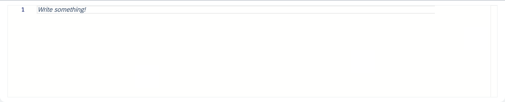
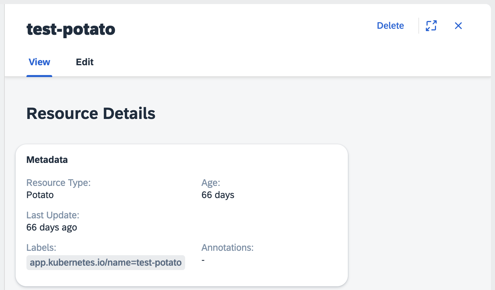

# Custom Busola Web Components

Busola provides a suite of custom Web Components to enhance your application's functionality. These components come with utility functions to dynamically update their properties, attributes, and slots after initialization.

## Utility Functions

All custom Web Components expose methods to dynamically update their properties, attributes, and slots after initialization.
String and boolean properties can be passed as standard HTML attributes. For example:

```HTML
<monaco-editor read-only="true"></monaco-editor>
```

Functions, objects, and arrays can be passed using the `setProp` function. For example:

```JS
const editor = document.querySelector('monaco-editor');
editor.setProp('on-change', (value) => console.log('New content:', value));
```

HTML elements can be passed using the `setSlot` attribute. For example:

```JS
const dynamicPage = document.querySelector('dynamic-page-component');
const customFooter = document.createElement('div');
customFooter.textContent = 'Custom Footer Content';
dynamicPage.setSlot('footer', customFooter);
```

## Custom Web Components

- [Monaco Editor](#monaco-editor)
- [Dynamic Page](#dynamic-page)

### Monaco Editor

The `Monaco Editor` component is a versatile code editor. It provides features such as syntax highlighting and autocompletion.
The `Monaco Editor` web component supports the following attributes and properties. Attributes correspond to camel-cased React props when accessed programmatically.

| Parameter                         | Required | Type     | Description                                                                                                        |
| --------------------------------- | -------- | -------- | ------------------------------------------------------------------------------------------------------------------ |
| **value**                         | No       | string   | The initial code content displayed in the editor. Defaults to an empty string.                                     |
| **placeholder**                   | No       | string   | Specifies a short hint about the input field value.                                                                |
| **language**                      | No       | string   | Specifies the programming language of the editor's content (e.g., `javascript`, `json`). Defaults to `javascript`. |
| **height**                        | No       | string   | Specifies the height of the component. Must include the unit (e.g., `100px`, `50vh`).                              |
| **autocompletion-disabled**       | No       | boolean  | Disables autocompletion suggestions when set to `true`.                                                            |
| **read-only**                     | No       | boolean  | Specifies if the field is read-only. Defaults to `false`.                                                          |
| **on-change**                     | No       | function | Callback function triggered when the content changes.                                                              |
| **on-mount**                      | No       | function | Callback function triggered when the editor mounts.                                                                |
| **on-blur**                       | No       | function | Callback function triggered when the editor loses focus.                                                           |
| **on-focus**                      | No       | function | Callback function triggered when the editor gains focus.                                                           |
| **update-value-on-parent-change** | No       | boolean  | Updates the editor content if the parent component changes its `value` prop.                                       |

See the following example:

```HTML
<monaco-editor
    value="console.log('Hello!')"
    language="javascript"
    height="200px"
    placeholder="Write some code..."
  ></monaco-editor>
```



### Dynamic Page

The `Dynamic Page` web component is used to display content on the page and consisting of a title, header, a content area, an optional inline edit form and floating footer.
The `Dynamic Page` supports the following attributes and properties. Attributes correspond to camel-cased React props when accessed programmatically.

| Parameter                      | Required | Type     | Description                                                                                                                                                                                     |
| ------------------------------ | -------- | -------- | ----------------------------------------------------------------------------------------------------------------------------------------------------------------------------------------------- |
| **title**                      | No       | string   | The title of the page displayed in the header.                                                                                                                                                  |
| **description**                | No       | string   | A description displayed below the title.                                                                                                                                                        |
| **actions**                    | No       | node     | Custom actions rendered in the header toolbar.                                                                                                                                                  |
| **children**                   | No       | node     | Child elements or components to be rendered within the page.                                                                                                                                    |
| **column-wrapper-class-name**  | No       | string   | Additional class names for the column wrapper, used for styling purposes.                                                                                                                       |
| **content**                    | No       | node     | Content displayed in the main section of the page.                                                                                                                                              |
| **footer**                     | No       | node     | Content displayed in the footer section.                                                                                                                                                        |
| **layout-number**              | No       | string   | Layout identifier for column management.                                                                                                                                                        |
| **layout-close-url**           | No       | string   | URL to navigate to when the column layout is closed.                                                                                                                                            |
| **inline-edit-form**           | No       | function | A function defining the inline edit form. It receives the `stickyHeaderHeight` as an argument and is expected to return a HTML element.                                                         |
| **show-yaml-tab**              | No       | boolean  | Specifies whether to show a YAML editing tab.                                                                                                                                                   |
| **protected-resource**         | No       | boolean  | Indicates whether the resource is protected.                                                                                                                                                    |
| **protected-resource-warning** | No       | node     | Warning message for protected resources.                                                                                                                                                        |
| **class-name**                 | No       | string   | Additional class names for the component, used for custom styling.                                                                                                                              |
| **custom-action-if-form-open** | No       | function | Specifies a custom action triggered when user tries to navigate out of the Edit form tab. It recieves four arguments: `isResourceEdited`, `setIsResourceEdited`, `isFormOpen`, `setIsFormOpen`. |

#### `custom-action-if-form-open`

The `custom-action-if-form-open` prop in the `Dynamic Page` component is a customizable callback function designed to handle specific actions when a form is open. It recieves four arguments:

| Argument                | Type     | Description                                                                                                                       |
| ----------------------- | -------- | --------------------------------------------------------------------------------------------------------------------------------- |
| **isResourceEdited**    | object   | Indicates if the current resource has been edited. The object has the structure: { isEdited: boolean; discardAction?: Function; } |
| **setIsResourceEdited** | function | A state setter function to update the `isResourceEdited` state.                                                                   |
| **isFormOpen**          | object   | Tracks the status of the inline edit form. The object has the structure: { formOpen: boolean; leavingForm: boolean; }             |
| **setIsFormOpen**       | function | A state setter function to update the `isFormOpen` state.                                                                         |

See the following example:

```HTML
<dynamic-page-component
  title="Sample Page"
  description="This is a dynamic page."
  show-yaml-tab="true"
  class-name="custom-page-class"
>
```



To see an exemplary configuration of the Busola custom extension feature using Web Components, check [this](examples/../../../examples/pizzas/README.md).
