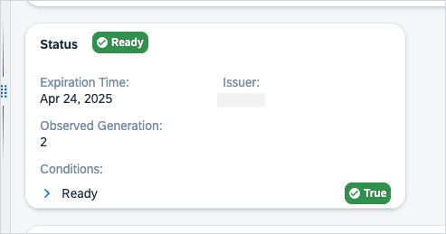

# Use JSONata Expressions with Resource-Based Extensions

[JSONata](https://docs.jsonata.org/overview.html) is a user-friendly language designed for querying and transforming JSON data. Inspired by XPath 3.1, it lets you write concise and powerful queries with ease. JSONata includes a variety of built-in operators and functions for manipulating data, and allows you to format the results into any JSON structure you need. You can even create your own functions to handle complex tasks, making JSON data processing simple and efficient.

JSONata comes with Kyma dashboard out-of-the-box, so you don't need to install any additional components.

## Scoping

The primary data source of JSONata expressions changes depending on where it's used. Starting with the root, it contains the whole resource, but whenever it's in a child whose parent has a **source** (in lists and details) or **path** (in forms) parameter, the scope changes to data from that source or path.

Additionally, the scope in arrays changes to the array item.

For example, for this resource:

```yaml
spec:
  name: foo
  description: bar
  items:
    - name: item-name
      details:
        status: ok
```

The following definition has their scope changed as follows:

```yaml
- source: spec.name # top level, scope is the same as a resource

- source: spec # top level, scope is the same as a resource
  children:
    - source: name # parent has source=spec, therefore this refers to spec.name

- children:
    - source: spec.name # As there's no parent source here, the scope is still the resource

- source: spec.items
  children:
    - source: name # parent data is an array, therefore scope changes to its item - this refers to spec.items[0].name
    - source: details.status # refers to spec.items[0].details.status (same as above)
    - source: details # this changes scope for its children again
      children:
        source: status # this refers to spec.items[0].details.status
```

## Common Variables

Common variables are the primary means to bypass the default scoping.

- **\$root** - always contains the reference to the resource, so any JSONata in the example above can always be `$root.spec.name`.
- **\$item** - refers to the most recent array item. When not in an array, it's equal to **\$root**.
- **\$items** - contains an array of references to all parent array items (with the last item being equal to **\$item**).
- **\$value** - when used in a JSONata other than **source** (for example **visibility**, but also other widget-specific formulas), contains the value returned by the source.
- **\$index** - exists in array components, refers to the index of the current item of an array.

### Example

```yaml
- widget: Table
  source: spec.rules
  visibility: $exists($value)
  collapsibleTitle: "'Rule #' & $string($index + 1)"
```

## Data Sources

Whenever data sources are provided, they are available as corresponding variable names. For more information, see [Configure the dataSources Section](90-datasources.md).

## Examples

* Filtering and displaying APIRUles with the `Error` status.

   ```yaml
   ...
  - name: Failing API Rules
    widget: Table
    source: $root
    targets:
      - slot: details-top
        location: ClusterOverview
      - slot: details-bottom
        location: ClusterOverview
        filter: '$item.status.APIRuleStatus.code="Ok"'
    filter: '$item.status.APIRuleStatus.code="Error"'
    order: 2
    children: 
      - name: Name
        source: metadata.name
        widget: Text
      - name: Namespace
        source: metadata.namespace
        widget: Text
      - name: status
        widget: Badge
        highlights: 
          positive:
            - 'Ok'
          critical:
            - 'Error'
            - 'Skipped'
        source: 'status.APIRuleStatus.code ? status.APIRuleStatus.code : "Unknown"'
        description: status.APIRuleStatus.desc
    ```

   

* Counting resource components.

   ```yaml
   ...
   - name: HPAs Statistical Injection Example
      widget: StatisticalCard
      source: status
      mainValue:
        name: Test1
        source: $count($item)
      children:
        - name: Test2
          source: "2"
        - name: Test3
          source: "3"
      targets:
        - location: ClusterOverview
          slot: health
    - name: MyTitle
      widget: RadialChart
      source: "22"
      maxValue: "44"
      color: var(--sapChart_OrderedColor_5)
      targets:
        - slot: health
          location: ClusterOverview
    ```

   

* Converting String into a readable date.

   ```yaml
   ...
   status:
      header:
        - name: status
          source: 'status.state ? status.state : "UNKNOWN"'
          highlights:
            unknown:
            - UNKNOWN
          widget: Badge
          description: status.message
      body:
        - name: conditions
          source: status.conditions
          widget: ConditionList
        - name: status.expirationDate
          source: '$readableTimestamp(status.expirationDate)'
        - name: issuer
          source: status.issuerRef.name
        - name: Observed Generation
          source: status.observedGeneration
    ...
    ```

   

## Related Information

[JSONata documentation](https://docs.jsonata.org/overview.html)
[Use JSONata Preset Functions for Resource-Based Extensions](101-jsonata-preset-functions.md)