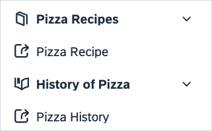

# Configure a Config Map for Resource-Based Extensions

You can set up your ConfigMap to handle your UI page by adding objects to the **general** section. This section contains basic information about the resource and additional options.
You can provide all the ConfigMap data sections as either JSON or YAML.

## Extension Version

The version is a string value that defines in which version the extension is configured. It is stored as a value of the `busola.io/extension-version` label. If the configuration is created with the **Create Extension** button, this value is provided automatically. When created manually, use the latest version number, for example, `'0.5'`.

> [!NOTE]
> Busola supports only the two latest versions of the configuration. Whenever a new version of the configuration is proposed, go to your Extension and migrate your configuration to the latest version.

## Available Parameters

| Parameter                          | Required | Type                                         | Description                                                                                                                                                                                                                    |                    |     |        |                                                                                                                    |     |
| ---------------------------------- | -------- | -------------------------------------------- | ------------------------------------------------------------------------------------------------------------------------------------------------------------------------------------------------------------------------------ | ------------------ | --- | ------ | ------------------------------------------------------------------------------------------------------------------ | --- |
| **resource**                       | **Yes**  |                                              | A resource defined based on the following properties:                                                                                                                                                                          |                    |     |        |                                                                                                                    |     |
| **resource.kind**                  | **Yes**  | string                                       | A Kubernetes resource kind.                                                                                                                                                                                                    |                    |     |        |                                                                                                                    |     |
| **resource.version**               | **Yes**  | string                                       | A Kubernetes resource version.                                                                                                                                                                                                 | **resource.group** | No  | string | An API group used for all the requests. It's not provided for the Kubernetes resources in the core (legacy) group. |     |
| **name**                           | No       | string                                       | A name used a title in the navigation and on the list screen. It defaults to its resource kind.                                                                                                                                |                    |     |        |                                                                                                                    |     |
| **category**                       | No       | string                                       | A name of the category used for the left-hand menu. By default, it's placed in the `Custom Resources` category.                                                                                                                |                    |     |        |                                                                                                                    |     |
| **icon**                           | No       |                                              | A suffix of an icon name used for the left-hand menu. The default value is `customized`. You can find the list of icons [here](https://sap.github.io/fundamental-react/?path=/docs/component-api-icon--primary).               |                    |     |        |                                                                                                                    |     |
| **scope**                          | No       | string                                       | It can be `namespace` or `cluster`. It defaults to `cluster`.                                                                                                                                                                  |                    |     |        |                                                                                                                    |     |
| **urlPath**                        | No       | string                                       | A path fragment for this resource used in the URL. Defaults to pluralized lowercase **kind**. It is used to provide an alternative URL to avoid conflicts with other resources.                                                |                    |     |        |                                                                                                                    |     |
| **defaultPlaceholder**             | No       | string                                       | It is visible in an empty text placeholder. Overridden by the widget-level **placeholder**. Defaults to `-`.                                                                                                                   |                    |     |        |                                                                                                                    |     |
| **description**                    | No       | string                                       | It displays a custom description on the resource list page. It can contain links. If the **translations** section has a translation entry with the ID that is the same as the **description** string, the translation is used. |                    |     |        |                                                                                                                    |     |
| **filter**                         | No       | string, [JSONata](100-jsonata.md) expression | An optional JSONata [filter](https://docs.jsonata.org/higher-order-functions#filter) used to filter the resources shown at the list section property.                                                                          |                    |     |        |                                                                                                                    |     |
| **features**                       | No       | boolean                                      | An object for the features configuration.                                                                                                                                                                                      |                    |     |        |                                                                                                                    |     |
| **features.actions**               | No       | boolean                                      | An object for the actions configuration.                                                                                                                                                                                       |                    |     |        |                                                                                                                    |     |
| **features.actions.disableCreate** | No       | boolean                                      | When set to `true`, it disables the **Create** button. It defaults to `false`.                                                                                                                                                 |                    |     |        |                                                                                                                    |     |
| **features.actions.disableEdit**   | No       | boolean                                      | When set to `true`, it disables the **Edit** button. It defaults to `false`.                                                                                                                                                   |                    |     |        |                                                                                                                    |     |
| **features.actions.disableDelete** | No       | boolean                                      | When set to `true`, it disables the **Delete** button. It defaults to `false`.                                                                                                                                                 |                    |     |        |                                                                                                                    |     |
| **externalNodes**                  | No       | string                                       | A list of links to external websites.                                                                                                                                                                                          |                    |     |        |                                                                                                                    |     |
| **externalNodes.category**         | No       | string                                       | A name of the category.                                                                                                                                                                                                        |                    |     |        |                                                                                                                    |     |
| **externalNodes.scope**            | No       | string                                       | It can be `namespace` or `cluster`. It defaults to `cluster`.                                                                                                                                                                  |                    |     |        |                                                                                                                    |     |
| **externalNodes.icon**             | No       | string                                       | An icon that you can choose from the [Icon Explorer](https://sdk.openui5.org/test-resources/sap/m/demokit/iconExplorer/webapp/index.html#/overview).                                                                           |                    |     |        |                                                                                                                    |     |
| **externalNodes.children**         | No       | string                                       | A list of child nodes containing details about the links.                                                                                                                                                                      |                    |     |        |                                                                                                                    |     |
| **externalNodes.children.label**   | No       | string                                       | A displayed label.                                                                                                                                                                                                             |                    |     |        |                                                                                                                    |     |
| **externalNodes.children.link**    | No       | string, [JSONata](100-jsonata.md) expression | A link to an external website.                                                                                                                                                                                                 |                    |     |        |                                                                                                                    |     |

### Example

```yaml
resource:
  kind: PizzaOrder
  version: v1alpha3
  group: busola.example.com
name: Pizza Orders
category: Lunch
scope: namespace
externalNodes:
  - category: Pizza Recipes
    icon: course-books
    scope: namespace
    children:
      - label: Pizza Recipe
        link: 'https://https://mypizzarecipes.com/'
  - category: History of Pizza
    icon: education
    scope: namespace
    children:
      - label: Pizza History
        link: '$string($exampleResource().link)'
```



For more information, see [Additional Sections for Resource-Based Extensions](130-additional-sections-resources.md).
