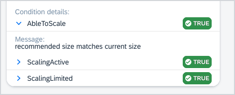
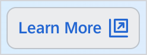
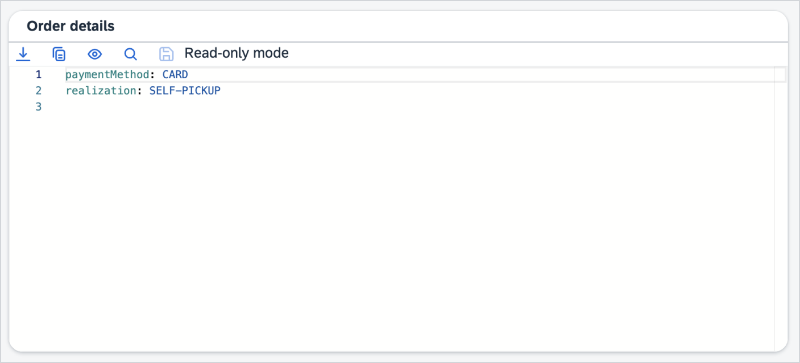
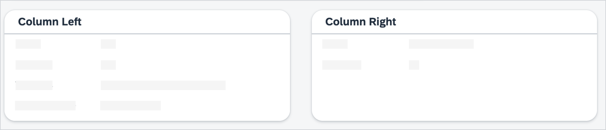
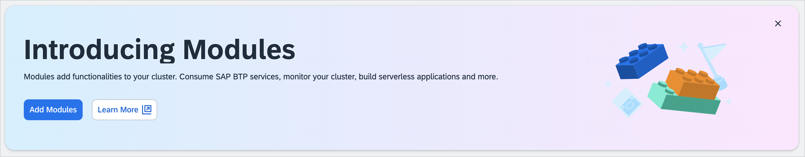
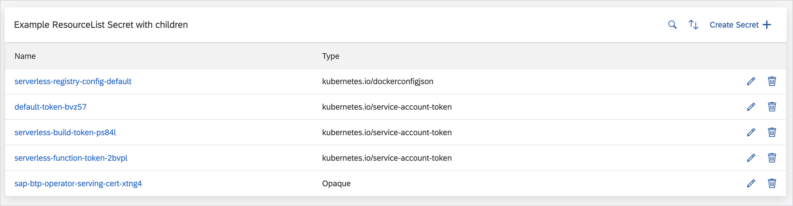

# List and Details Widgets

You can use list and details widgets in the lists and details pages in the user interface component of your resource. You can distinguish the following widget types:

- [Inline widgets](#inline-widgets) for simple values in **data.list**, **data.details.header**, **data.details.status** and **data.detail.bodies**
  - [`Bagde`](#badge)
  - [`ControlledBy`](#controlledby)
  - [`ConditionList`](#conditionList) - used only in **data.details.status**
  - [`ExternalLink`](#externallink)
  - [`ExternalLinkButton`](#externallinkbutton)
  - [`JoinedArray`](#joinedarray)
  - [`Labels`](#labels)
  - [`ResourceButton`](#resourcebutton)
  - [`ResourceLink`](#resourcelink)
  - [`Text`](#text)
- [Block widgets](#block-widgets) for more complex layouts used only in **data.details.body**
  - [`Alert`](#alert)
  - [`CodeViewer`](#codeviewer)
  - [`Columns`](#columns)
  - [`EventList`](#eventlist)
  - [`FeatureCard`](#featuredcard)
  - [`Panel`](#panel)
  - [`Plain`](#plain)
  - [`ResourceList`](#resourcelist)
  - [`ResourceRefs`](#resourcerefs)
  - [`Table`](#table)
  - [`Tabs`](#tabs)
  - [`StatisticalCard`](#StatisticalCard) - TODO: Where to put it exactly?

## Inline Widgets

Use inline widgets for simple values in **data.list**, **data.details.header**, and **data.detail.bodies**.

### `Badge`

The `Badge` widgets render texts as a status badge, using a set of predefined rules to assign colors.

These are the available `Bagde` widget parameters:

| Parameter       | Required | Type                             | Description                                                                                                                                                                                                                                                                                                                                                                                                                                                                                                                                                                                                                 |
| --------------- | -------- | -------------------------------- | --------------------------------------------------------------------------------------------------------------------------------------------------------------------------------------------------------------------------------------------------------------------------------------------------------------------------------------------------------------------------------------------------------------------------------------------------------------------------------------------------------------------------------------------------------------------------------------------------------------------------- |
| **placeholder** | No       | string                           | Changes the default empty text placeholder `-` with a custom string. If the **translations** section has a translation entry with the ID that is the same as the **placeholder** string, the translation is used.                                                                                                                                                                                                                                                                                                                                                                                                           |
| **highlights**  | No       |                                  | A map of highlight rules. Key refers to the type of highlight, while the rule can just be a plain array of values or a string containing a [JSONata](jsonata.md) rule. Allowed keys are `informative`, `positive`, `warning` and `critical`. <br><br> When no highlights are provided, the following values are automatically handled: <br> - rendered as informative: `initial`, `pending`, `available`, `released`. <br> - rendered as positive: `ready`, `bound`, `running`, `success`, `succeeded`, `ok`. <br> - rendered as warning: `unknown`, `warning`. <br> - rendered as critical: `error`, `failure`, `invalid`. |
| **description** | No       | [JSONata](jsonata.md) expression | Used to fetch additional information that will be displayed in a tooltip when hovering over the badge.                                                                                                                                                                                                                                                                                                                                                                                                                                                                                                                      |
| **copyable**    | No       | boolean                          | A flag indicating if the **Copy to clipboard** button should be displayed next to the widget. By default set to `false`.                                                                                                                                                                                                                                                                                                                                                                                                                                                                                                    |

See the following example:

```yaml
- source: status.value
  widget: Badge
  placeholder: '-'
  highlights:
    positive:
      - Running
      - ok
    critical: $item < 0
  description: status.message
```


<br/><br/>


### `ControlledBy`

The `ControlledBy` widgets render the kind and the name with a link to the resources that the current resource is dependent on.

These are the available `ControlledBy` widget parameters:

| Parameter       | Required | Type    | Description                                                                                                                                                                                                       |
| --------------- | -------- | ------- | ----------------------------------------------------------------------------------------------------------------------------------------------------------------------------------------------------------------- |
| **placeholder** | No       | string  | Changes the default empty text placeholder `-` with a custom string. If the **translations** section has a translation entry with the ID that is the same as the **placeholder** string, the translation is used. |
| **kindOnly**    | No       | boolean | Determines if the resource name is displayed. Defaults to `false`.                                                                                                                                                |

This is an example of kind and name link:

```yaml
- source: metadata.ownerReferences
  widget: ControlledBy
  placeholder: '-'
```


This is an exaple of kind only:

```yaml
- source: metadata.ownerReferences
  widget: ControlledBy
  placeholder: '-'
  kindOnly: true
```

### ConditionList

The condition List widget renders the conditions as an expandable list with condition details.

#### Example

```yaml
- name: Condition details
  widget: ConditionList
  source: status.conditions
```




### `ExternalLink`

The `ExternalLink` widgets render the link to an external page.

These are the available `ExternalLink` widget parameters:

| Parameter    | Required | Type                           | Description                                                                                                              |
| ------------ | -------- | ------------------------------ | ------------------------------------------------------------------------------------------------------------------------ |
| **link**     | No       | [JSONata](jsonata.md) function | Generate a custom link. Default value is taken from **source**.                                                          |
| **copyable** | No       | boolean                        | A flag indicating if the **Copy to clipboard** button should be displayed next to the widget. By default set to `false`. |

This is an example of the linkFormula and textFormula usage:

```yaml
- source: '$item.port.name'
  name: spec.servers.port.name
  widget: ExternalLink
  link: "'https://' & $item.port.name & ':' & $string($item.port.number)"
```


This is an example of source only usage:

```yaml
- widget: ExternalLink
  source: '$item.hosts'
  name: spec.servers.hosts
```


### `ExternalLinkButton`

The `ExternalLinkButton` widgets render the link to an external page using a button.

These are the available `ExternalLinkButton` widget parameters:

| Parameter      | Required | Type    | Description                                                                                                 |
| -------------- | -------- | ------- | ----------------------------------------------------------------------------------------------------------- |
| **link**       | **Yes**  | boolean | A flag to set the target URL.                                                                               |
| **name**       | No       | string  | An optional flag. The default value is `Learn More`.                                                        |
| **emphasized** | No       | boolean | Defines the visual appearence of the button. Can be either `true` or `false`. The default valie is `false`. |

See the following example:

```yaml
- widget: ExternalLinkButton
  link: https://help.sap.com/docs/btp/sap-business-technology-platform/kyma-s-modular-approach
```



### `JoinedArray`

The `JoinedArray` widgets render all the values of an array of strings as a comma-separated list.

These are the available `JoinedArray` widget parameters:

| Parameter     | Required | Type      | Description                                                                                                                                            |
| ------------- | -------- | --------- | ------------------------------------------------------------------------------------------------------------------------------------------------------ |
| **separator** | No       | string    | A string by which the elements of the array are separated. The default value is a comma `,`. You can use `break` to separate elements with a new line. |
| **children**  | No       | []objects | Defines widgets used for rendering array items. If not provided, the content is rendered as a string.                                                  |
| **copyable**  | No       | boolean   | A flag indicating if the **Copy to clipboard** button should be displayed next to the widget. By default set to `false`.                               |

See the following example:

```yaml
- name: Joined array
  source: spec.dnsNames
  widget: JoinedArray
  separator: ': '
- name: Joined array
  source: spec.statuses
  widget: JoinedArray
  children:
    - source: $item
      widget: Badge
```


### `Labels`

The `Labels` widgets render all the array or object entries in the `value` or `key-value` format.

These are the available `Labels` widget parameters:

| Parameter       | Required | Type    | Description                                                                                                                                                                                                       |
| --------------- | -------- | ------- | ----------------------------------------------------------------------------------------------------------------------------------------------------------------------------------------------------------------- |
| **placeholder** | No       | string  | Changes the default empty text placeholder `-` with a custom string. If the **translations** section has a translation entry with the ID that is the same as the **placeholder** string, the translation is used. |
| **copyable**    | No       | boolean | A flag indicating if the **Copy to clipboard** button should be displayed next to the widget. By default set to `false`.                                                                                          |

See the following example:

```yaml
- source: spec.orderDetails
  widget: Labels
  placeholder: '-'
```


### `ResourceButton`

The `ResourceButton` widgets render a button that links to Kubernetes resources.

These are the available `ResourceButton` widget parameters:

| Parameter    | Required | Type                             | Description                                                                                                                                                                                                                                                                                                                                                |
| ------------ | -------- | -------------------------------- | ---------------------------------------------------------------------------------------------------------------------------------------------------------------------------------------------------------------------------------------------------------------------------------------------------------------------------------------------------------- |
| **icon**     | No       | string                           | The name of an icon for this button. You can find the list of available icons [here](https://sap.github.io/fundamental-react/?path=/docs/component-api-icon--primary). Use string after `--`, for example, if an icon is named `sap-icon--accept`, use `accept`.                                                                                           |
| **resource** | **Yes**  | object                           | To create a hyperlink, Busola needs the name and the kind of the target resource; they must be passed into the **resource** object as property paths in either **\$item** - value extracted using **source**, or **\$root** - the original resource. If the target resource is in a `namespace`, provide **Namespace**, **name**, and **kind** properties. |
| **source**   | **Yes**  | [JSONata](jsonata.md) expression | Resolves the link text. This property has access to **\$item** and **\$root**.                                                                                                                                                                                                                                                                             |

This is an example for widget usage in the details section:

```yaml
- widget: ResourceButton
  source: "metadata.ownerReferences[0].status = 'Running' ? 'otherTranslations.linkText' : 'otherTranslations.errorLinkText'"
  resource:
    name: metadata.ownerReferences[0].name
    namespace: $root.metadata.namespace
    kind: "'Deployment'"
  icon: add
```


### `ResourceLink`

The `ResourceLink` widgets render internal links to Kubernetes resources.

These are the available `ResourceLink` widget parameters:

| Parameter    | Required | Type                             | Description                                                                                                                                                                                                                                                                                                                                                |
| ------------ | -------- | -------------------------------- | ---------------------------------------------------------------------------------------------------------------------------------------------------------------------------------------------------------------------------------------------------------------------------------------------------------------------------------------------------------- |
| **resource** | **Yes**  | object                           | To create a hyperlink, Busola needs the name and the kind of the target resource. They must be passed into the **resource** object as property paths in either **\$item** - value extracted using **source**, or **\$root** - the original resource. If the target resource is in a `namespace`, provide **namespace**, **name**, and **kind** properties. |
| **source**   | **Yes**  | [JSONata](jsonata.md) expression | Resolves the link text. This property has access to **\$item** and **\$root**.                                                                                                                                                                                                                                                                             |

This is an example of the `ResourceLink` widget usage in the details section:

```yaml
- widget: ResourceLink
  source: "metadata.ownerReferences[0].status = 'Running' ? 'otherTranslations.linkText' : 'otherTranslations.errorLinkText'"
  resource:
    name: metadata.ownerReferences[0].name
    namespace: $root.metadata.namespace
    kind: "'Deployment'"
```


### `Text`

The `Text` widgets render values as a simple text. This is the default behavior for all scalar values.

These are the available `Text` widget parameters:

| Parameter       | Required | Type    | Description                                                                                                                                                                                                      |
| --------------- | -------- | ------- | ---------------------------------------------------------------------------------------------------------------------------------------------------------------------------------------------------------------- |
| **placeholder** | No       | string  | Change the default empty text placeholder `-` with a custom string. If the **translations** section has a translation entry with the ID that is the same as the **placeholder** string, the translation is used. |
| **copyable**    | No       | boolean | A flag indicating if the **Copy to clipboard** button should be displayed next to the widget. By default set to `false`.                                                                                         |

See the following example:

```yaml
- source: spec.label
  widget: Text
  placeholder: '-'
```


## Block Widgets

Block widgets are more complex layouts and you must use them only in the details body.

### `Alert`

The `Alert` widgets display values using predefined types.

These are the available `Alert` widget parameters:

| Parameter         | Required | Type    | Description                                                                                                                    |
| ----------------- | -------- | ------- | ------------------------------------------------------------------------------------------------------------------------------ |
| **disableMargin** | No       | boolean | Disables the margin outside the alert body.                                                                                    |
| **severity**      | No       | string  | Specifies one of the alert severities: `information`, `warning`, `error`, or `success`. By default, it's set to `information`. |

See the following example:

```yaml
- source: "'I am some warning for a user'"
  widget: Alert
  severity: warning

- source: "$item.port.number = 80  ? 'Using Default 80' : 'Using Different Port then 80'"
  widget: Alert
  disableMargin: true
```

### `CodeViewer`

The `CodeViewer` widgets display values using a read-only code editor.

These are the available `CodeViewer` widget parameters:

| Parameter    | Required | Type                             | Description                                                                                                                                                                                                                                                                                                                                                |
| ------------ | -------- | -------------------------------- | ---------------------------------------------------------------------------------------------------------------------------------------------------------------------------------------------------------------------------------------------------------------------------------------------------------------------------------------------------------- |
| **language** | No       | [JSONata](jsonata.md) expression | Resolves the desired language, used for code highlighting. It has access to the `$root` variable, containing the entire resource. The editor supports languages handled by [Monaco](https://code.visualstudio.com/docs/languages/overview). If the language is not specified, the editor tries to display the content as `yaml` with a fallback to `json`. |

See the following example:

```yaml
- source: spec.json-data
  widget: CodeViewer
  language: "$root.spec.language = 'JavaScript' ? 'javascript' : 'yaml'"
```



### `Columns`

The `Columns` widgets render the child widgets in multiple columns.

These are the available `Columns` widget parameters:

| Parameter  | Required | Type    | Description                                                                                                                                                                                   |
| ---------- | -------- | ------- | --------------------------------------------------------------------------------------------------------------------------------------------------------------------------------------------- |
| **inline** | No       | boolean | Change the layout mode. <br><br> - `true` - list is displayed inline, wrapped if needed. It is a default option for lists, panels, and headers. <br> - `false` - list is displayed as a grid. |

See the following example:

```yaml
- name: columns.container
  widget: Columns
  children:
    - name: columns.left
      widget: Panel
      children:
        - source: spec.value
          placeholder: '-'
    - name: columns.right
      widget: Panel
      children:
        - source: spec.other-value
```



### `EventList`

The `EventList` widget renders a list of Events.

These are the available `Columns` widget parameters:

| Parameter               | Required | Type                           | Description                                                                                                                                                                                                                                    |
| ----------------------- | -------- | ------------------------------ | ---------------------------------------------------------------------------------------------------------------------------------------------------------------------------------------------------------------------------------------------- |
| **filter**              | No       | [JSONata](jsonata.md) function | Use it to filter Events emitted by a specific resource. There is a special custom function [matchEvents](jsonata.md#matcheventsitem-kind-name) you can use to filter Events, for example, `$matchEvents($$, $root.kind, $root.metadata.name)`. |
| **defaultType**         | No       | string                         | The value is either: `all`, `information`, or `warning`. When set to `information` or `warning`, Events with specific type are displayed. By default all Events are fetched.                                                                   |
| **hideInvolvedObjects** | No       | boolean                        | If set to `true`, the **Involved Objects** column is hidden. Defaults to `false`.                                                                                                                                                              |

See the following examples:

```yaml
- widget: EventList
  filter: '$matchEvents($$, $root.kind, $root.metadata.name)'
  name: events
  defaultType: information
```


---

```yaml
- widget: EventList
  filter: '$matchEvents($$, $root.kind, $root.metadata.name)'
  name: events
  defaultType: information
  hideInvolvedObjects: true
```


### `FeaturedCard`

The `FeaturedCard` widgets render a promotional banner with its own title, description, illustration, and a maximum of 2 additional children.
The `FeaturedCard` can be closed in the top right corner.
It is important to select a unique ID for each `FeaturedCard`, since it will be displayed/hidden based on its ID.

**TIP:** It is **recommended** to use the `FeatureCard` widget via [injections](./70-widget-injection.md) (**slot: banner**). This will turn all `FeatureCards` at the top of a section into a carousel-component. Nevertheless, it is also possible to use it as a regular widget.

These are the available `FeatureCard` widget parameters:

| Parameter        | Required | Type      | Description                                                                                                                                                       |
| ---------------- | -------- | --------- | ----------------------------------------------------------------------------------------------------------------------------------------------------------------- |
| **title**        | No       | string    | Renders the title.                                                                                                                                                |
| **description**  | No       | string    | Renders the description.                                                                                                                                          |
| **id**           | **Yes**  | string    | Defines the banner's **(unique!)** identifier.                                                                                                                    |
| **children**     | No       | []objects | Defines the banner's children that are displayed below the description. It is recommended to use button-like components here. The maximum number of objects is 2. |
| **illustration** | No       | string    | Defines the illustration displayed on the right. Can be one of the following: `Modules` (default), `AI`                                                           |
| **design**       | No       | string    | Defines the background color-gradient of the banner. Can be one of the following: `information-1` (default), `information-2`.                                     |

See the following example:

```yaml
injections: |-
  - title: Introducing Modules
    name: Modules
    description: Modules add functionalities to your cluster. Consume SAP BTP services, monitor your cluster, build serverless applications and more.
    widget: FeaturedCard
    source: $
    id: ModulesBanner
    order: 0
    illustration: Modules
    design: information-1
    children:
      - widget: ResourceButton
        source: "'Modify Modules'"
        resource: 
          customUrl: kymamodules
      - widget: ExternalLinkButton
        link: https://help.sap.com/docs/btp/sap-business-technology-platform/kyma-s-modular-approach
    targets:
      - slot: banner
        location: ClusterOverview
```



### `Panel`

The `Panel` widgets render an object as a separate panel with its own title (based on its `source` or `name`).

These are the available `Panel` widget parameters:

| Parameter          | Required | Type    | Description                                                                                                                                                                                                                 |
| ------------------ | -------- | ------- | --------------------------------------------------------------------------------------------------------------------------------------------------------------------------------------------------------------------------- |
| **header**         | No       | array   | Allows you to, for example, display labels in the panel header.                                                                                                                                                             |
| **disablePadding** | No       | boolean | Disables the padding inside the panel body.                                                                                                                                                                                 |
| **description**    | No       | string  | Displays a custom description on the resource list page. It can contain links. If the **translations** section has a translation entry with the ID that is the same as the **description** string, the translation is used. |
| **decodable**      | No       | boolean | Decodes the values of all the children using base64 - must be used together with the **source** parameter.                                                                                                                  |

See the following example:

```yaml
- name: Details
  widget: Panel
  description: To check the extensibility documentation go to the {{[Busola page](https://github.com/kyma-project/busola/tree/main/docs/extensibility)}}.
  children:
    - source: spec.value
    - source: spec.other-value
      placeholder: '-'
- source: spec
  widget: Panel
  children:
    - source: '$parent.entry1'
    - source: '$parent.entry2'
```


See the following example:

```yaml
- widget: Panel
  name: spec.selector
  children:
    - source: '$podSelector()'
      widget: ResourceList
  header:
    - source: spec.selector
      widget: Labels
      name: spec.selector
      visibility: spec.selector
- widget: Secret
  source: '$secret().data'
  decodable: true
  children:
    - source: secret_id
    - source: secret_name
```

### `Plain`

The `Plain` widgets render all contents of an object or list sequentially without any decorations. This is the default behavior for all objects and arrays.

### `ResourceList`

The `ResourceList` widgets render a list of Kubernetes resources. The ResourceList widgets should be used along with the [related resources](datasources-section.md).

These are the available `ResourceList` widget parameters:

| Parameter                 | Required | Type                                   | Description                                                                                                                                                                                                                                                |
| ------------------------- | -------- | -------------------------------------- | ---------------------------------------------------------------------------------------------------------------------------------------------------------------------------------------------------------------------------------------------------------- |
| **children**              | No       | []objects                              | Used to obtain custom columns. If not set, the configuration is reused based on the existing resource list, defined in Busola or using extensibility.                                                                                                      |
| **sort**                  | No       | []objects                              | Allows you to sort by the value from the given **source**.                                                                                                                                                                                                 |
| **sort.source**           | **Yes**  | [JSONata](jsonata.md) expression       | Used to fetch data for the column. In its simplest form, it's the path to the value.                                                                                                                                                                       |
| **sort.default**          | No       | boolean                                | An optional flag. If set to `true`, the list view is sorted by this value by default.                                                                                                                                                                      |
| **sort.compareFunction**  | No       | [JSONata](jsonata.md) compare function | It is required to use `$first` and `$second` variables when comparing two values. There is a special custom function [compareStrings](jsonata.md#comparestringsfirst-second) used to compare two strings, for example, `$compareStrings($first, $second)`. |
| **search**                | No       | []objects                              | Allows you to search for resources including the value from the given **source**.                                                                                                                                                                          |
| **search.source**         | **Yes**  | [JSONata](jsonata.md) expression       | Used to fetch data for the column. In its simplest form, it's the path to the value.                                                                                                                                                                       |
| **search.searchFunction** | No       | [JSONata](jsonata.md) search function  | It allows you to use the `$input` variable to get the search input's value that can be used to search for more complex data.                                                                                                                               |

Since the `ResourceList` widget does more than just list the items, you must provide the whole data source (`$myResource()`) instead of just the items (`$myResource().items`).

See the following examples"

```yaml
- widget: ResourceList
  source: '$myDeployments()'
  name: Example ResourceList Deployments
  sort:
    - source: spec.replicas
      compareFunction: '$second - $first'
    - source: spec.strategy.type
      compareFunction: '$compareStrings($second, $first)'
      default: true
  search:
    - source: spec.replicas
    - source: spec.containers
      searchFunction: '$filter(spec.containers, function($c){ $contains($c.image, $input) })'
```


---

```yaml
- widget: ResourceList
  path: '$mySecrets'
  name: Example ResourceList Secret with children
  children:
    - source: '$item'
      name: Name
      sort: 'true'
      widget: ResourceLink
      resource:
        name: $item.metadata.name
        namespace: root.metadata.namespace
        kind: $item.kind
    - source: type
      name: Type
      search: true
      sort:
        default: true
```



### `ResourceRefs`

The `ResourceRefs` widgets render the lists of links to the associated resources. The corresponding specification object must be an array of objects `{name: 'foo', namespace: 'bar'}`.

These are the available `ResourceRefs` widget parameters:

| Parameter | Required | Type   | Description                      |
| --------- | -------- | ------ | -------------------------------- |
| **kind**  | **Yes**  | string | Kubernetes kind of the resource. |

See the following example:

```yaml
- source: spec.item-list
  widget: ResourceRefs
  kind: Secret
```


### `Table`

Table widgets display array data as rows of a table instead of free-standing components. The **children** parameter defines the values used to render the columns. Similar to the **list** section of the ConfigMap, you should use inline widgets only as children.

These are the available `Table` widget parameters:

| Parameter              | Required | Type                                         | Description                                                                                                                                                                                                                                                                                                                                                                                                                                                                                                                                                                                      |
| ---------------------- | -------- | -------------------------------------------- | ------------------------------------------------------------------------------------------------------------------------------------------------------------------------------------------------------------------------------------------------------------------------------------------------------------------------------------------------------------------------------------------------------------------------------------------------------------------------------------------------------------------------------------------------------------------------------------------------ |
| **collapsible**        | No       | array of widgets                             | Displays as an extra collapsible section. Uses the same format as the **children** parameter.                                                                                                                                                                                                                                                                                                                                                                                                                                                                                                    |
| **collapsibleTitle**   | No       | string or the [JSONata](jsonata.md) function | Defines the title for the collapsible sections.                                                                                                                                                                                                                                                                                                                                                                                                                                                                                                                                                  |
| **disablePadding**     | No       | boolean                                      | Disables the padding inside the panel body.                                                                                                                                                                                                                                                                                                                                                                                                                                                                                                                                                      |
| **showHeader**         | No       | boolean                                      | Disables displaying the head row.                                                                                                                                                                                                                                                                                                                                                                                                                                                                                                                                                                |
| **extraHeaderContent** | No       | array of extra widgets                       | Displays as an action section. Uses the same format as the **children** parameter.                                                                                                                                                                                                                                                                                                                                                                                                                                                                                                               |
| **sort**               | No       | boolean                                      | If set to `true`, it allows you to sort using this value. Defaults to false. It can also be set to an object with the following properties: <br>>br> - **default** - optional flag. If set to `true`, the list view is sorted by this value by default. <br> - **compareFunction** - optional [JSONata](jsonata.md) compare function. It is required to use `$first` and `$second` variables when comparing two values. There is a special custom function [compareStrings](jsonata.md#comparestringsfirst-second) used to compare two strings, for example, `$compareStrings($first, $second)`. |
| **search**             | No       | boolean                                      | If set to `true`, it allows you to search the resource list by this value. Defaults to false. It can also be set to an object with the following property: <br><br> - **searchFunction** - optional [JSONata](jsonata.md) search function. It allows you to use the `$input` variable to get the search input's value that can be used to search for more complex data.                                                                                                                                                                                                                          |

See the following example:

```yaml
- source: spec.toppings
  widget: Table
  collapsibleTitle: "'Topping #' & $string($index + 1) & (' ' & $join($keys($item), ' '))"
  collapsible:
    - source: quantity
  children:
    - source: name
      sort: true
    - source: price
      sort:
        default: true
        compareFunction: '$second -$first'
      search:
        searchFunction: '$filter($item.price, function($p){ $p > $number($input) }'
```


### `Tabs`

Tabs widgets render the child widgets in multiple tabs.

See the following example:

```yaml
- widget: Tabs
  children:
    - name: General
      children:
        - widget: Panel
          name: Overview
          source: '...'
    - name: Resources
      children:
        - widget: ResourceRefs
          source: '...'
```


### StatisticalCard

StatisticalCard widgets render a card component with a several numerical information elements.
This widget is primarily designed to be used via [injections](#widget-injections-overview) (**destination: ClusterStats, slot: cards**), allowing the card to be rendered within the dense grid layout of the ClusterOverview's statistical cards section.

These are the available `ResourceRefs` widget parameters:

| Parameter       | Required | Type   | Description              |
| --------------- | -------- | ------ | ------------------------ |
| **resourceURL** | **No**   | string | Path to busola resource. |

#### Example

```yaml
injections: |-
  - name: MyTitle
    widget: StatisticalCard
    source: status
    mainValue:
      name: MySubtitle
      source: $item.importantValue
    resourceUrl: pods
    isClusterResource: false
    children:
      - name: ExtraInformation1
        soure: $item.value1
      - title: ExtraInformation2
        source: $item.value2
    targets:
      - location: ClusterStats
        slot: cards
```


