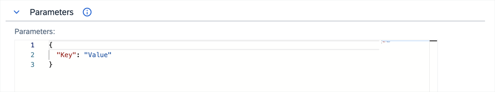
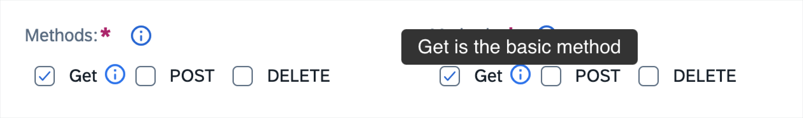
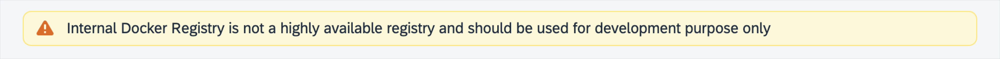
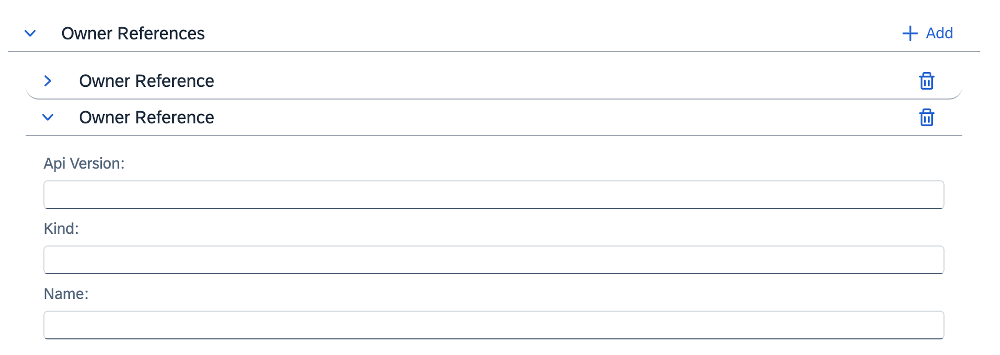
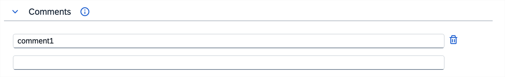

# Form Widgets

You can use form widgets in the create and/or edit pages in the user interface component of your resource. You can distinguish the following widget types:

* [Simple widgets](#simple-widgets) that represent a single scalar value
  * [`Text`](#text)
  * [`Name`](#name)
  * [`CodeEditor`](#codeeditor)
  * [`Resource`](#resource)
  * [`MultiCheckbox`](#multicheckbox)
* [Complex widgets](#complex-widgets) that handle more advanced data structures such as arrays or objects
  * [`Alert`](#alert)
  * [`KeyValuePair`](#keyvaluepair)
  * [`ResourceRef`](#resourceref)
* [Presentation widgets](#presentation-widgets) that group content into a more readable form
  * [`FormGroup`](#formgroup)
  * [`GenericList`](#genericlist)
  * [`SimpleList`](#simplelist)

## Simple widgets

Simple widgets represent a single scalar value.

### `Text`

The `Text` widgets render a field as a text field. They are used by default for all string values.

These are the available `Text` widget parameters:

| Parameter | Required | Type | Description |
|-----------|----------|------|-------------|
| **enum[]** | | an array of options | Generate an input field with a dropdown. Optionally can be a string containing a [JSONata](jsonata.md) expression returning an array of options. |
| **placeholder**| | | Specifies a short hint about the input field value. |
| **required** | | boolean | Specifies if a field is required. The default value is taken from CustomResourceDefintion (CRD); if it doesn't exist in the CRD, then it defaults to `false`. |
| **inputInfo** | | string | A string below the input field that shows how to fill in the input. You can use the {{ [`name`] (`link`) }} format to display a `name` instead of a `link. |
| **description** | | string | A string displayed in a tooltip when you hover over a question mark icon, next to the input's label. The default value is taken from the CustomResourceDefintion (CRD). |
| **readOnly** | | boolean | Specifies if a field is read-only. Defaults to `false`. |
| **decodable** | | boolean | Specifies that the field is base64-encoded and can be decoded in the UI. It can't be used together with **enum**. |
| **decodedPlacehoder** | No | | An optional alternative placeholder to use when the field is decoded. |

See the following examples:

```yaml
- path: spec.my-data
  widget: Text
- path: spec.base64-data
  widget: Text
  decodable: true
  placeholder: Base-64 encoded data
  decodedPlaceholder: Plain text data
```


```yaml
- path: protocol
  enum:
    - HTTP
    - HTTPS
    - HTTP2
    - GRPC
    - GRPC-WEB
    - MONGO
    - REDIS
    - MYSQL
    - TCP
  description: Choose a protocol type from the dropdown.
  tooltip: Specifies which protocol to use for tunneling the downstream connection.
```


### `Name`

The `Name` widgets render a name input field. They contain an automatic name generator, and additionally set the label field when changed. They are added automatically to all forms, and set to the `metadata.name` value.

These are the available `Name` widget parameters:

| Parameter | Required | Type | Description |
|-----------|----------|------|-------------|
| **extraPaths** | | | An array of extra paths to fill in with the contents of the field. Each path can either be a period-separated string or an array of strings. |
| **placeholder** | | |  Specifies a short hint about the input field value. |
| **inputInfo** | | string | A string below the input field that shows how to fill in the input. It defaults to `Name must consist of lowercase alphanumeric characters or '-', and must start and end with an alphanumeric character (e.g. 'my-name', or '123-abc').`. To disable any suggestion, set this value to `null`. |
| **description** | | string | A string displayed in a tooltip when you hover over a question mark icon, next to the input's label. The default value is taken from the CustomResourceDefintion (CRD). |
| **disableOnEdit** | | | Disables a field in edit mode, defaults to `false`. |
| **required** |  | boolean | Specifies if a field is required. The default value is taken from CRD; if it doesn't exist in CRD, then it defaults to `false`. |

See the following examples:

```yaml
- path: spec.my-data
  widget: Name
```


```yaml
- path: spec.my-data
  widget: Name
  disableOnEdit: true
```


### `CodeEditor`

The `CodeEditor` widgets render a versatile code editor that can be used to edit any variable. The editor's default language is JSON.

These are the available `CodeEditor` widget parameters:

| Parameter | Required | Type | Description |
|-----------|----------|------|-------------|
| **language** | | a [JSONata](jsonata.md) expression | Resolves the desired language. It has access to the `$root` variable, containing the entire resource. |
| **inputInfo** | | string | A string below the input field that shows how to fill in the input. You can use the {{ [`name`] (`link`) }} format to display a `name` instead of a `link. |
| **description** | | string | A string displayed in a tooltip when you hover over a question mark icon, next to the input's label. The default value is taken from the CustomResourceDefintion (CRD). |
| **defaultExpanded** | | boolean | Specifies if the widget should be expanded by default. Defaults to `false`. |

See the following example:

```yaml
- path: spec.data
  widget: CodeEditor
  inputInfo: Data needs to be a valid JSON object.
  description: Data is passed on to the application.
  language: "'JSON'"
```



> **NOTE:** Remember to put both single and double quotes if you want to use plain language (for example, "'YAML'"). Specifying just double quotes ("YAML") makes Busola try to access a nonexistent YAML variable, resulting in the language being `undefined`.

### `Resource`

The `Resource` widgets render a dropdown list of specified resources and store the selected one as a string containing its name.

These are the available `Bagde` widget parameters:

| Parameter | Required | Type | Description |
|-----------|----------|------|-------------|
| **resource** | | | |
| **resource.kind** | Yes | | Kubernetes kind of the resource. |
| **resource.group** | No | | API group used for all requests. Not provided for Kubernetes resources in the core (also called legacy) group. |
| **resource.version** | Yes | | The API version used for all requests. |
| **resource.scope** | | | The value is either `namespace` or `cluster`. When set to `cluster`, namespaced resources are fetched from all Namespaces. Defaults to `cluster`. |
| **resource.namespace** | | | The namespace to fetch resources from. Used only when scope is `namespace` and resources need to be fetched from a specific Namespace. Defaults to the active Namespace when omitted. |
| **filter** | | JSONata expression | Filters resources based on a given condition. |
| **provideVar** | | | When this field is defined, the chosen resource is provided as a variable of this name. |
| **required** | | boolean | Specifies if a field is required. The default value is taken from CRD; if it doesn't exist in CRD, then it defaults to `false`. |
| **inputInfo** | | string |A string below the input field that shows how to fill in the input. You can use the {{ [`name`] (`link`) }} format to display a `name` instead of a `link. |
| **description** | | string | A string displayed in a tooltip when you hover over a question mark icon, next to the input's label. The default value is taken from the CustomResourceDefintion (CRD). |

See the following example:

```yaml
- path: spec.namespace
  widget: Resource
  resource:
    scope: cluster
    kind: Namespace
    version: v1
- path: spec.gateway
  widget: Resource
  resource:
    kind: Gateway
    scope: namespace
    namespace: kyma-system
    group: networking.istio.io
    version: v1alpha3
```


### `MultiCheckbox`

The `MultiCheckbox` widgets render checkboxes that are saved into one path as an array of strings.

These are the available `Bagde` widget parameters:

| Parameter | Required | Type | Description |
|-----------|----------|------|-------------|
| **options[]** | Yes | an array of objects | Generate the checkboxes. |
| **options.key** | Yes | | The value used to generate checkboxes. It is set if a checkbox is selected. This `key`, together with the `path` defined for MultiCheckbox (`{path}.{key}`), can be used for **translation**. |
| **options.name** | No | | An optional name for a checkbox instead of the default capitalized last part of the path. This can be a key from the **translation** section. |
| **options.description** | No | string | The string displayed in a tooltip when you hover over a question mark icon, next to the checkbox's label. |
| **required** | | boolean | Specifies if a field is required. The default value is taken from CustomResourceDefintion (CRD); if it doesn't exist in the CRD, then it defaults to `false`. |
| **inputInfo** | | string | A string below the input field that shows how to write in the input. You can use the {{ [`name`] (`link`) }} format to display a `name` instead of a `link. |
| **description** | | string | A string displayed in a tooltip when you hover over a question mark icon, next to the input's label. The default value is taken from the CustomResourceDefintion (CRD). |
| **readOnly** | | boolean | Specifies if a field is read-only. Defaults to `false`. |

See the following example:

```yaml
- widget: MultiCheckbox
  path: spec.methods
  options:
    - key: GET
      name: Get
      description: Get is the basic method
    - key: POST
    - key: DELETE
```



## Complex Widgets

Complex widgets handle more advanced data structures such as arrays or objects.

These are the available complex widgets:

* [`Alert`](#alert)
* [`KeyValuePair`](#keyvaluepair)
* [`ResourceRef`](#resourceref)

### `Alert`

The `Alert` widgets display values using predefined types.

These are the available `Bagde` widget parameters:

| Parameter | Required | Type | Description |
|-----------|----------|------|-------------|
| **alert** | | | The information that you want to display. |
| **disableMargin** | No | boolean | Disables the margin outside the alert body. |
| **severity** | | | Specifies one of the alert severities: `information`, `warning`, `error`, or `success`. By default, it's set to **information**. |

See the following example:

```yaml
- widget: Alert
  severity: warning
  alert: "'alert.tls.https'"
  visibility: "$value.port.protocol = 'HTTPS'"

- widget: Alert
  alert: "$item = 80  ? 'Using Default 80' : 'Using Different Port then 80'"
```



### `KeyValuePair`

The `KeyValuePair` widgets render an `object` value as a list of fields. One is used for a key and the other for a value, allowing for adding and removing entries.

These are the available `KeyValuePair` widget parameters:

| Parameter | Required | Type | Description |
|-----------|----------|------|-------------|
| **required** | | boolean | Specifies if a field is required. The default value is taken from CRD; if it doesn't exist in the CRD, then it defaults to `false`. |
| **keyEnum[]** | | an array of options | Generate a key input field with a dropdown. |
| **value** | | | |
| **value.type** | | string | Specifies the type of the value input. The options are `object`, `number`, `text`. Defaults to `text`. |
| **value.keyEnum[]** | | array of options | Generate a key input field with a dropdown only if the `type` is set to `object`. |
| **value.valueEnum[]** | | an array of options | Generate a value input field with a dropdown. |
| **inputInfo** | | string | A string below the input field that shows how to fill in the input. You can use the {{ [`name`] (`link`) }} format to display a `name` instead of a `link. |
| **description** | | string | A string displayed in a tooltip when you hover over a question mark icon, next to the input's label. The default value is taken from the CustomResourceDefintion (CRD). |
| **defaultExpanded** | | boolean | Specifies if the widget should be expanded by default. Defaults to `false`. |

See the following example:

```yaml
- path: spec.my-data
  widget: KeyValuePair
  description: Key and value must start and end with an alphanumeric character.
  tooltip: >
    Labels are intended to be used to specify identifying attributes of objects
    that are meaningful and relevant to users, but do not directly imply semantics
    to the core system.
  keyEnum:
    - prefix
    - regex
    - exact
```


### `ResourceRef`

The `ResourceRef` widgets render two dropdowns to select the associated resources' names and Namespaces. The corresponding specification object is of the form `{name: 'foo', namespace: 'bar'}`. If this widget is provided with children, they are rendered as usual.

These are the available `ResourceRef` widget parameters:

| Parameter | Required | Type | Description |
|-----------|----------|------|-------------|
| **resource** | | | |
| **resource.kind** | Yes | | Kubernetes kind of the resource. |
| **resource.group** | | | The API group used for all requests. Not provided for Kubernetes resources in the core (also called legacy) group. |
| **resource.version** | Yes | | The API version used for all requests. |
| **filter** | | JSONata expression | Flters resources based on a given condition. |
| **provideVar** | | | When this field is defined, the chosen resource will be provided as a variable of this name. |
| **toInternal** | |  a [JSONata](jsonata.md) function | Converts from the stored value to the `{name, namespace}` format. Useful, for example, when the data is stored as a string. |
| **toExternal** | | | A corresponding function to convert back to store. |
| **defaultExpanded** | | boolean | Specifies if the widget should be expanded by default. Defaults to `false`. |

See the following example:

```yaml
- path: spec.my-data
  widget: ResourceRef
  resource:
    kind: Secret
    version: v1
  provideVar: secret
  children:
    - path: key
      enum: '$keys($secret.data)'
- path: spec.my-gateways
  widget: ResourceRef
  resource:
    kind: Gateway
    group: networking.istio.io
    version: v1alpha3
  toInternal: |
    (
      $values := $split($, '/');
      { 'namespace': $values[0], 'name': $values[1] }
    )
  toExternal: namespace & '/' & name
```


## Presentation Widgets

Presentation widgets do not handle data directly but group contents into a more readable form.

### `FormGroup`

The `FormGroup` widgets render an `object` as a collapsible section.

These are the available `FormGroup` widget parameters:

| Parameter | Required | Type | Description |
|-----------|----------|------|-------------|
| **columns** | | | The number of columns the content is rendered in. Defaults to 1. |
| **defaultExpanded** | | boolean | Specifies if the widget should be expanded by default. Defaults to `false`. |

See the following example:

```yaml
- path: spec.service
  widget: FormGroup
  children:
    - path: host
    - path: port
```


### `GenericList`

The `GenericList` widgets render an array as a list of collapsible sections with their own sub-forms. An **Add** button is present to add new entries.

These are the available `GenericList` widget parameters:

| Parameter | Required | Type | Description |
|-----------|----------|------|-------------|
| **placeholder** | | | Specifies a short hint about the input field value. |
| **template** | | | Specifies default structure for a list item. |
| **defaultExpanded** | | boolean | Specifies if the widget should be expanded by default. Defaults to `false`. |
| **required** | | boolean | Specifies if a field is required. The default value is taken from CRD; if it doesn't exist in the CRD, then it defaults to `false`. |

See the following example:

```yaml
- path: spec.services
  widget: GenericList
  children:
    - path: '[].host'
    - path: '[].port'

 - widget: GenericList
   path: spec.filter.filters
   children:
     - path: '[].eventType.value'
       placeholder: placeholder.eventType
     - path: '[].eventSource.value'
   template:
     eventSource:
       property: source
       type: exact
       value: ''
     eventType:
       property: type
       type: exact
```



### `SimpleList`

The `SimpleList` widgets render an array as a table with rows representing data items and columns representing different fields. New items are added automatically when new entries are typed in.

> **NOTE:** This type of field is only suitable for simple data types and can't contain more complex structures in its items.

These are the available `SimpleList` widget parameters:

| Parameter | Required | Type | Description |
|-----------|----------|------|-------------|
| **placeholder** | | | Specifies a short hint about the input field value. |
| **required** | No | boolean | Specifies if a field is required. The default value is taken from CRD; if it doesn't exist in the CRD, then it defaults to `false`. |
| **inputInfo** | | string | A string below the input field that shows how to fill in the input. You can use the {{ [`name`] (`link`) }} format to display a `name` instead of a `link. |
| **description** | | string | A string displayed in a tooltip when you hover over a question mark icon, next to the input's label. The default value is taken from the CustomResourceDefintion (CRD). |
| **defaultExpanded** | | boolean | Specifies if the widget should be expanded by default. Defaults to `false`. |

See the following example:

```yaml
- path: spec.services
  widget: SimpleList
  children:
    - path: '[].host'
      placeholder: Enter the required host
    - path: '[].port'
      placeholder: Enter the required port
```



#### Scalar Values

When array items are scalars instead of objects, a child still has to be provided with the path `[]`; no header with the field title is then rendered in the resulting table.

```yaml
- path: spec.services
  widget: SimpleList
  children:
    - path: '[]'
```
