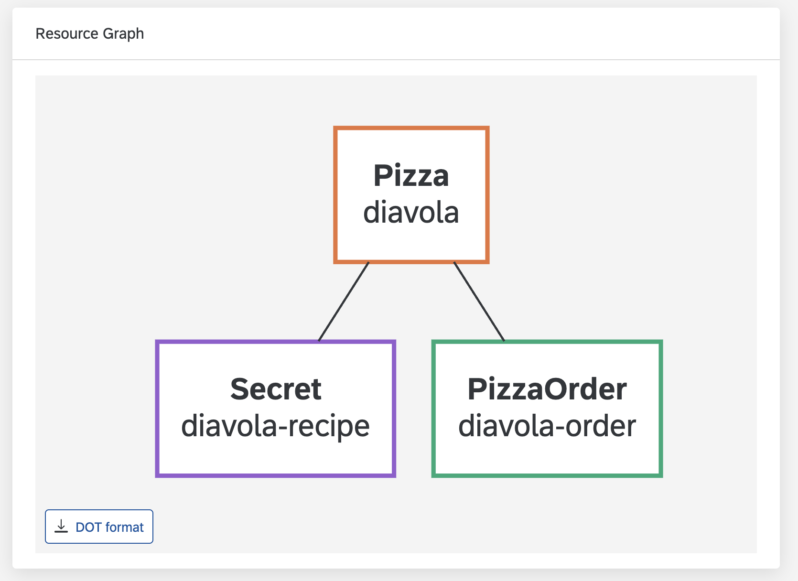
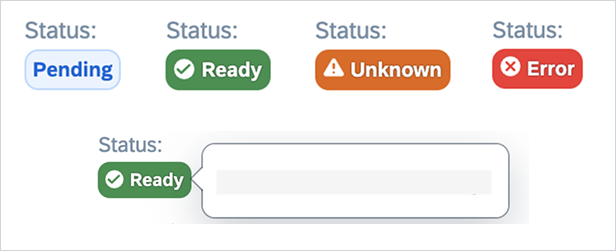
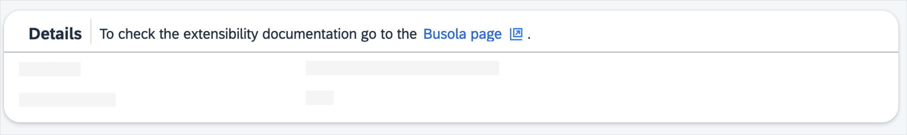
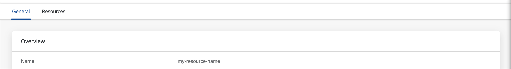

# Customize UI display

- [Resource _list_ overview](#resource-list-overview)
- [Resource _details_ overview](#resource-details-overview)
  - [Header and body parameters](#header-and-body-parameters)
  - [ResourceGraph parameters](#resourcegraph-parameters)
  - [Data scoping](#data-scoping)
- [Inline widgets](#inline-widgets)
  - [Badge](#badge)
  - [ControlledBy](#controlledby)
  - [ExternalLink](#externallink)
  - [JoinedArray](#joinedarray)
  - [Labels](#labels)
  - [ResourceLink](#resourcelink)
  - [Text](#text)
- [Block widgets](#block-widgets)
  - [Alert](#alert)
  - [CodeViewer](#codeviewer)
  - [Columns](#columns)
  - [Panel](#panel)
  - [Plain](#plain)
  - [ResourceList](#resourcelist)
  - [ResourceRefs](#resourcerefs)
  - [Table](#table)
  - [Tabs](#tabs)

## Resource _list_ overview

You can customize the resource list by adding objects to the **list** section in your resource ConfigMap.
Each object adds a new column to your table.

### Available _list_ section parameters

- **source** - _[required]_ contains a [JSONata](https://docs.jsonata.org/overview.html) expression used to fetch data for the column. In its simplest form, it's the path to the value.
- **widget** - optional widget used to render the field referred to by the **source** property. By default, the value is displayed verbatim.
- **valuePreprocessor** - name of [value preprocessor](resources.md#value-preprocessors).
- **sort** - optional sort option. If set to `true`, it allows you to sort the resource list using this value. Defaults to false. It can also be set to an object with the following properties:
  - **default** - optional flag. If set to `true`, the list view is sorted by this value by default.
  - **compareFunction** - optional [JSONata](https://docs.jsonata.org/overview.html) compare function. It is required to use `$first` and `$second` variables when comparing two values. There is a special custom function [compareStrings](jsonata.md#comparestringsfirst-second) used to compare two strings, for example, `$compareStrings($first, $second)`

### Example

```yaml
- source: spec.url
  sort:
    default: true
    compareFunction: '$compareStrings($first, $second)'
- source: spec.priority
  widget: Badge
- source: "$join(spec.toppings.name, ', ')"
- name: quantityIsMore
  source:
    '$filter(spec.toppings, function ($v, $i, $a) { $v.quantity > $average($a.quantity)
    })'
- source: "$join(spec.volumes.name, ', ')"
- source: "$filter(spec.volumes, function ($v, $i, $a) {'configMap' in $keys($v)})" # List the array of volume objects that have a ConfigMap
- source: spec.volumes['configMap' in $keys($)] # This is the alternative way of listing the array of volume objects that have a ConfigMap
- source: "$join(spec.volumes['configMap' in $keys($)].name, ', ')" # List volume names of volumes that have a ConfigMap
```

## Resource _details_ overview

The **details** section defines the display structure for the details page.
It contains three optional components, `header`, `body`, and `resourceGraph`.

> **NOTE:** `header` and `body` are arrays of objects, and the `resourceGraph` component is an object.

The first two components are a list of widgets to display in the **header** section and the body of the page respectively.
You can use the `resourceGraph` component to configure the ResourceGraph, which shows relationships between resources.

### Header and body parameters

- **source** - contains a [JSONata](https://docs.jsonata.org/overview.html) expression used to fetch data for the widget. In its simplest form, it's the path to the value. Not required for presentational widgets.
- **name** - Name for the primary label of this field. Required for most widgets (except for some rare cases that don't display a label). This can be a key to use from the **translation** section.
- **widget** - optional widget to render the defined entry. By default the value is displayed verbatim.
- **valuePreprocessor** - name of [value preprocessor](resources.md#value-preprocessors).
- **visibility** - by default all fields are visible; however, you can use the **visibility** property to control a single item display.
  - If set to `false` explicitly, the field doesn't render.
  - If set to any string, this property is treated as JSONata format, determining (based on current value given as `data`) if the field should be visible.
  - If not set, the field always renders.
- **children** - a list of child widgets used for all `object` and `array` fields.

Extra parameters might be available for specific widgets.

### Header and body example

```yaml
header:
  - source: metadata.name
  - source: spec.priority
    widget: Badge
  - source: "$join(spec.volumes.name, ', ')"
body:
  - name: columns
    widget: Columns
    children:
      - name: left-panel
        widget: Panel
      - name: right-panel
        widget: Panel
  - name: summary
    widget: Panel
    children:
      - source: metadata.name
      - source: spec.priority
        widget: Badge
      - name: Volumes names of volumes with config map
        source: "$join(spec.volumes['configMap' in $keys($)].name, ', ')"
  - source: spec.details
    widget: CodeViewer
    language: "'json'"
  - source: spec.configPatches
    widget: Panel
    children:
      - source: applyTo
      - source: match.context
        visibility: '$exists(data.match.context)'
  - source: spec.configPatches
    widget: Table
    children:
      - source: applyTo
      - source: match.context
```

### resourceGraph parameters

- **depth** - defines the maximum distance from the original resource to a transitively related resource. Defaults to `infinity`.
- **colorVariant** - optional integer in range 1 to 11 or `neutral`, denoting the SAP color variant of the node's border. If not set, the node's border is the same as the current text color.
- **networkFlowKind** - optional boolean which determines if the resource should be shown on the network graph, Defaults to `false`, which displays the resource on the structural graph.
- **networkFlowLevel** - optional integer which sets the horizontal position of the resource's node on the network graph.
- **dataSources** - an array of objects in shape:
  - **source** - a string that must correspond to one of the [dataSources](datasources-section.md) name. It selects the related resource and the way it should be matched.

### resourceGraph example

```yaml
details:
  resourceGraph:
    colorVariant: 2
    dataSources:
      - source: relatedSecrets
      - source: relatedPizzaOrders
dataSources:
  relatedSecrets:
    resource:
      kind: Secret
      version: v1
    filter: '$root.spec.recipeSecret = $item.metadata.name'
  relatedPizzaOrders:
    resource:
      kind: PizzaOrder
      group: busola.example.com
      version: v1
    filter: '$item.spec.pizzas[name = $root.metadata.name and namespace = $root.metadata.namespace]'
```



### Data scoping

Whenever an entry has both **source** and **children** properties, the **children** elements are provided with extra variables.

In the case of objects, a `$parent` variable contains the data of the parent element.

For example:

```yaml
- source: spec
  widget: Panel
  children:
    - source: '$parent.entry1'
    - source: '$parent.entry2'
```

renders the data for `spec.entry1` and `spec.entry2`.

In the case of array-based components, an `$item` variable contains data for each child. For example:

```yaml
- source: spec.data
  widget: Table
  children:
    - source: '$item.name'
    - source: '$item.description'
```

renders `spec.data[].name` and `spec.data[].description`.

---

You can use display widgets in the lists and details pages.

## Inline widgets

Use inline widgets for simple values in lists, details headers, and details bodies.

### Badge

Badge widgets render texts as a status badge, using a set of predefined rules to assign colors.

#### Widget-specific parameters

- **placeholder** - an optional property to change the default empty text placeholder `-` with a custom string.
  If the **translations** section has a translation entry with the ID that is the same as the **placeholder** string, the translation is used.
- **highlights** - an optional map of highlight rules. Key refers to the type of highlight, while the rule can just be a plain array of values or a string containing a jsonata rule. Allowed keys are `informative` `positive`, `negative` and `critical`.
- **description** - a [JSONata](https://docs.jsonata.org/overview.html) expression used to fetch additional information that will be displayed in a tooltip when hovering over the badge.

#### Default highlight rules

When no highlights are provided, the following values are automatically handled:

- rendered as informative: `initial`, `pending`, `available`, `released`.
- rendered as positive: `ready`, `bound`, `running`, `success`, `succeeded`, `ok`.
- rendered as negative: `unknown`, `warning`.
- rendered as critical: `error`, `failure`, `invalid`.

#### Example

```yaml
- source: status.value
  widget: Badge
  placeholder: '-'
  highlights:
    positive:
      - Running
      - ok
    negative: data < 0
  description: status.message
```


<br/><br/>


### ControlledBy

ControlledBy widgets render the kind and the name with a link to the resources that the current resource is dependent on.

#### Widget-specific parameters

- **placeholder** - an optional property to change the default empty text placeholder `-` with a custom string.
  If the **translations** section has a translation entry with the ID that is the same as the **placeholder** string, the translation is used.
- **kindOnly** - used to determine if the resource name is displayed. Defaults to _false_.

#### Examples

##### Kind and name link

```yaml
- source: metadata.ownerReferences
  widget: ControlledBy
  placeholder: '-'
```


##### Kind only

```yaml
- source: metadata.ownerReferences
  widget: ControlledBy
  placeholder: '-'
  kindOnly: true
```


### ExternalLink

ExternalLink widgets render the link to an external page.

#### Widget-specific parameters

- **link** - an optional JSONata function to generate a custom link. Default value is taken from **source**.

#### Examples

##### linkFormula and textFormula usage

```yaml
- source: '$item.port.name'
  name: spec.servers.port.name
  widget: ExternalLink
  link: "'https://' & $item.port.name & ':' & $string($item.port.number)"
```


##### Source only

```yaml
- widget: ExternalLink
  source: '$item.hosts'
  name: spec.servers.hosts
```


### JoinedArray

JoinedArray widgets render all the values of an array of strings as a comma-separated list.

#### Widget-specific parameters

- **separator** - a string by which the elements of the array are separated. The default value is a comma `,`. You can use `break` to separate elements with a new line.
- **children** - an optional field to define widgets used for rendering array items. If not provided, the content is rendered as a string.

#### Example

```yaml
- name: Joined array
  source: spec.dnsNames
  widget: JoinedArray
  separator: ': '
- name: Joined array
  source: spec.statuses
  widget: JoinedArray
  children:
    - source: $item
      widget: Badge
```


### Labels

Labels widgets render all the array or object entries in the `value` or `key-value` format.

#### Widget-specific parameters

- **placeholder** - an optional property to change the default empty text placeholder `-` with a custom string.
  If the **translations** section has a translation entry with the ID that is the same as the **placeholder** string, the translation is used.

```yaml
- source: spec.orderDetails
  widget: Labels
  placeholder: '-'
```


### ResourceLink

ResourceLink widgets render internal links to Kubernetes resources.

#### Widget-specific parameters

- **resource** - To create a hyperlink, Busola needs the name and the kind of the target resource; they must be passed into the **resource** object as property paths in either **data** - value extracted using **source**, or **root** - the original resource. If the target resource is in a `namespace`, provide **namespace**, **name**, and **kind** properties.
- **linkText** - a JSONata expression resolving a link text, this property has access to **data** and **root**. To insert dynamic parts of translations, use double quotes `Go to {{data.name}}`.

#### Example

##### _details_ section

```yaml
- widget: ResourceLink
  source: metadata.ownerReferences[0]
  linkText: "data.status = 'Running' ? 'otherTranslations.linkText' : 'otherTranslations.errorLinkText'"
  resource:
    name: data.name
    namespace: root.metadata.namespace
    kind: "'Deployment'"
```


##### _translations_ section

```yaml
en:
  otherTranslations.linkText: 'Go to {{data.kind}} {{data.name}}'
  otherTranslations.errorLinkText: 'Error in {{data.kind}} {{data.name}}'
```

### Text

Text widgets render values as a simple text. This is the default behavior for all scalar values.

#### Widget-specific parameters

- **placeholder** - an optional property to change the default empty text placeholder `-` with a custom string.
  If the **translations** section has a translation entry with the ID that is the same as the **placeholder** string, the translation is used.

#### Example

```yaml
- source: spec.label
  widget: Text
  placeholder: '-'
```


## Block widgets

Block widgets are more complex layouts and you must use them only in the details body.

### Alert

Alert widgets display values using predefined types.

#### Widget-specific parameters

- **disableMargin** - an optional boolean which disables the margin outside the alert body.
- **type** - specifies one of the alert types: **information**, **warning**, **error**, or **success**. By default, it's set to **information**.

#### Example

```yaml
- source: "'I am some warning for a user'"
  widget: Alert
  type: warning

- source: "$item.port.number = 80  ? 'Using Default 80' : 'Using Different Port then 80'"
  widget: Alert
  disableMargin: true
```

### CodeViewer

CodeViewer widgets display values using a read-only code editor.

#### Widget-specific parameters

- **language** - a JSONata expression resolving the desired language, used for code highlighting. It has access to the `$root` variable, containing the entire resource. The editor supports languages handled by [Monaco](https://code.visualstudio.com/docs/languages/overview).
  If the language is not specified, the editor tries to display the content as `yaml` with a fallback to `json`.

#### Example

```yaml
- source: spec.json-data
  widget: CodeViewer
  language: "$root.spec.language = 'JavaScript' ? 'javascript' : 'yaml'"
```


### Columns

Columns widgets render the child widgets in multiple columns.

#### Widget-specific parameters

- **inline** - an optional flag to change the layout mode.

  - **true** - list is displayed inline, wrapped if needed. It is a default option for lists, panels, and headers.
  - **false** - list is displayed as a grid.

#### Example

```yaml
- name: columns.container
  widget: Columns
  children:
    - name: columns.left
      widget: Panel
      children:
        - source: spec.value
          placeholder: '-'
    - name: columns.right
      widget: Panel
      children:
        - source: spec.other-value
```


### Panel

Panel widgets render an object as a separate panel with its own title (based on its `source` or `name`).

#### Example

```yaml
- name: Details
  widget: Panel
  description: To check the extensibility documentation go to the {{[Busola page](https://github.com/kyma-project/busola/tree/main/docs/extensibility)}}.
  children:
    - source: spec.value
    - source: spec.other-value
      placeholder: '-'
- source: spec
  widget: Panel
  children:
    - source: '$parent.entry1'
    - source: '$parent.entry2'
```



#### Widget-specific parameters

- **header** - an optional array that allows you to, for example, display labels in the panel header.
- **disablePadding** - an optional boolean which disables the padding inside the panel body.
- **description** - displays a custom description on the resource list page. It can contain links. If the **translations** section has a translation entry with the ID that is the same as the **description** string, the translation is used.

#### Example

```yaml
- widget: Panel
  name: spec.selector
  children:
    - source: '$podSelector()'
      widget: ResourceList
  header:
    - source: spec.selector
      widget: Labels
      name: spec.selector
      visibility: spec.selector
```

### Plain

Plain widgets render all contents of an object or list sequentially without any decorations. This is the default behavior for all objects and arrays.

### ResourceList

ResourceList widgets render a list of Kubernetes resources. The ResourceList widgets should be used along with the [related resources](datasources-section.md).

#### Widget-specific parameters

- **children** optional field used to obtain custom columns. If not set, the configuration is reused based on the existing resource list, defined in Busola.
- **sort** - optional sort option. It's an array of objects that allows you to sort by the value from the given **source**.
  - **source** - _[required]_ contains a [JSONata](https://docs.jsonata.org/overview.html) expression used to fetch data for the column. In its simplest form, it's the path to the value.
  - **default** - optional flag. If set to `true`, the list view is sorted by this value by default.
  - **compareFunction** - optional [JSONata](https://docs.jsonata.org/overview.html) compare function. It is required to use `$first` and `$second` variables when comparing two values. There is a special custom function [compareStrings](jsonata.md#comparestringsfirst-second) used to compare two strings, for example, `$compareStrings($first, $second)`

Since the **ResourceList** widget does more than just list the items, you must provide the whole data source (`$myResource()`) instead of just the items (`$myResource().items`).

#### Examples

```yaml
- widget: ResourceList
  source: '$myDeployments()'
  name: Example ResourceList Deployments
  sort:
    - source: spec.replicas
      compareFunction: '$second - $first'
    - source: '$item.spec.strategy.type'
      compareFunction: '$compareStrings($second, $first)'
      default: true
```


---

```yaml
- widget: ResourceList
  path: '$mySecrets'
  name: Example ResourceList Secret with children
  children:
    - source: '$item'
      name: Name
      sort: 'true'
      widget: ResourceLink
      resource:
        name: data.metadata.name
        namespace: root.metadata.namespace
        kind: data.kind
    - source: type
      name: Type
      sort:
        default: true
```


### ResourceRefs

ResourceRefs widgets render the lists of links to the associated resources. The corresponding specification object must be an array of objects `{name: 'foo', namespace: 'bar'}`.

#### Widget-specific parameters

- **kind** - _[required]_ Kubernetes kind of the resource.

#### Example

```yaml
- source: spec.item-list
  widget: ResourceRefs
  kind: Secret
```


### Table

Table widgets display array data as rows of a table instead of free-standing components. The **children** parameter defines the values used to render the columns. Similar to the **list** section of the ConfigMap, you should use inline widgets only as children.

#### Widget-specific parameters

- **collapsible** - an optional array of extra widgets to display as an extra collapsible section. Uses the same format as the **children** parameter.
- **collapsibleTitle** - an optional option for **collapsible** to define title for the collapsible sections, as string or the JSONata function.
- **disablePadding** - an optional boolean which disables the padding inside the panel body.
- **showHeader** - an optional boolean which disables displaying the head row.
- **showSearchField** - an optional boolean which disables displaying the search input.
- **sort** - optional sort option. If set to `true`, it allows you to sort using this value. Defaults to false. It can also be set to an object with the following properties:
  - **default** - optional flag. If set to `true`, the list view is sorted by this value by default.
  - **compareFunction** - optional [JSONata](https://docs.jsonata.org/overview.html) compare function. It is required to use `$first` and `$second` variables when comparing two values. There is a special custom function [compareStrings](jsonata.md#comparestringsfirst-second) used to compare two strings, for example, `$compareStrings($first, $second)`

#### Example

```yaml
- source: spec.toppings
  widget: Table
  collapsibleTitle: "'Topping #' & $string($index + 1) & (' ' & $join($keys($item), ' '))"
  collapsible:
    - source: quantity
  children:
    - source: '$item.name'
      sort: true
    - source: '$item.price'
      sort:
        default: true
        compareFunction: '$second -$first'
```


### Tabs

Tabs widgets render the child widgets in multiple tabs.

#### Example

```yaml
- widget: Tabs
  children:
    - name: General
      children:
        - widget: Panel
          name: Overview
          source: '...'
    - name: Resources
      children:
        - widget: ResourceRefs
          source: '...'
```


