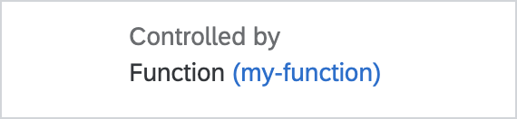
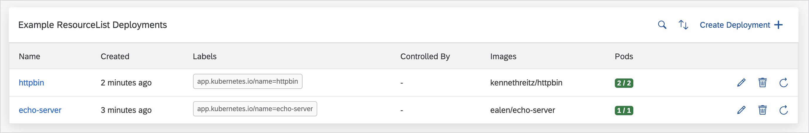
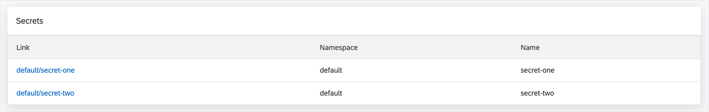
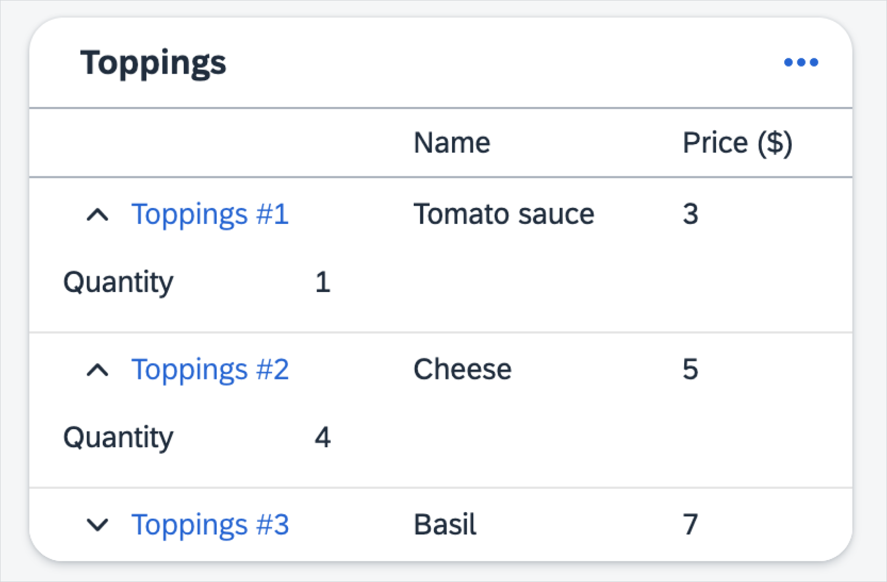

# Display widgets

- [Inline widgets](#inline-widgets)
  - [Badge](#badge)
  - [ControlledBy](#controlledby)
  - [JoinedArray](#joinedarray)
  - [Labels](#labels)
  - [ResourceLink](#resourcelink)
  - [Text](#text)
- [Block widgets](#block-widgets)
  - [CodeViewer](#codeviewer)
  - [Columns](#columns)
  - [Panel](#panel)
  - [Plain](#plain)
  - [ResourceList](#resourcelist)
  - [ResourceRefs](#resourcerefs)
  - [Table](#table)

You can use display widgets in the lists and details pages.

## Inline widgets

Use inline widgets for simple values in lists, details headers, and details bodies.

### Badge

Badge widgets render texts as a status badge, using a set of predefined rules to assign colors.

#### Widget-specific parameters

- **placeholder** - an optional property to change the default empty text placeholder `-` with a custom string.
  If the **translations** section has a translation entry with the ID that is the same as the **placeholder** string, the translation is used.
- **highlights** - an optional map of highlight rules. Key refers to the type of highlight, while the rule can just be a plain array of values or a string containing a jsonata rule. Allowed keys are `informative` `positive`, `negative` and `critical`.

#### Default highlight rules

When no highlights are provided, the following values are automatically handled:

- rendered as informative: `initial`, `pending`, `available`, `released`.
- rendered as positive: `ready`, `bound`, `running`, `success`, `succeeded`, `ok`.
- rendered as negative: `unknown`, `warning`.
- rendered as critical: `error`, `failure`, `invalid`.

#### Example

```json
{
  "path": "status.value",
  "widget": "Badge",
  "placeholder": "-",
  "highlights": {
    "positive": ["yes", "ok"],
    "negative": "data < 0"
  }
}
```


### ControlledBy

ControlledBy widgets render the kind and the name with a link to the resources that the current resource is dependent on.

#### Widget-specific parameters

- **placeholder** - an optional property to change the default empty text placeholder `-` with a custom string.
  If the **translations** section has a translation entry with the ID that is the same as the **placeholder** string, the translation is used.
- **kindOnly** - used to determine if the resource name is displayed. Defaults to _false_.

#### Examples

##### Kind and name link

```json
{
  "path": "metadata.ownerReferences",
  "widget": "ControlledBy",
  "placeholder": "-"
}
```



##### Kind only

```json
{
  "path": "metadata.ownerReferences",
  "widget": "ControlledBy",
  "placeholder": "-",
  "kindOnly": true
}
```


### JoinedArray

JoinedArray widgets render all the values of an array of strings as a comma-separated list.

#### Widget-specific parameters

- **separator** - a string by which the elements of the array will be separated by. The default value is a comma `,`.

#### Example

```json
{
  "name": "Joined array",
  "path": "spec.dnsNames",
  "widget": "JoinedArray",
  "separator": ": "
}
```


### Labels

Labels widgets render all the object entries in the `key-value` format.

#### Widget-specific parameters

- **placeholder** - an optional property to change the default empty text placeholder `-` with a custom string.
  If the **translations** section has a translation entry with the ID that is the same as the **placeholder** string, the translation is used.

```json
{
  "path": "spec.orderDetails",
  "widget": "Labels",
  "placeholder": "-"
}
```


### ResourceLink

ResourceLink widgets render internal links to Kubernetes resources.

#### Widget-specific parameters

- **resource** - To create a hyperlink, Busola needs the name and the kind of the target resource; they must be passed into the **resource** object as property paths in either **data** - value extracted using **path**, or **root** - the original resource. If the target resource is in a `namespace`, provide **namespace**, **name**, and **kind** properties.
- **linkText** - this property has access to **data** and **root**. This makes it possible to insert resource properties into a translation.

#### Example

##### _details_ section

```json
{
  "widget": "ResourceLink",
  "path": "metadata.ownerReferences[0]",
  "linkText": "otherTranslations.linkText",
  "resource": {
    "name": "data.name",
    "namespace": "root.metadata.namespace",
    "kind": "data.kind"
  }
}
```


##### _translations_ section

```yaml
en:
  otherTranslations.linkText: Go to {{data.kind}} {{data.name}}.
```

### Text

Text widgets render values as a simple text. This is the default behavior for all scalar values.

#### Widget-specific parameters

- **placeholder** - an optional property to change the default empty text placeholder `-` with a custom string.
  If the **translations** section has a translation entry with the ID that is the same as the **placeholder** string, the translation is used.

#### Example

```json
{
  "path": "spec.label",
  "widget": "Text",
  "placeholder": "-"
}
```


## Block widgets

Block widgets are more complex layouts and you must use them only in the details body.

### CodeViewer

CodeViewer widgets display values using a read-only code editor.

#### Widget-specific parameters

- **language** - used for code highlighting. The editor supports languages handled by [Monaco](https://code.visualstudio.com/docs/languages/overview).
  If the language is not specified, the editor tries to display the content as `yaml` with a fallback to `json`.

#### Example

```json
{
  "path": "spec.json-data",
  "widget": "CodeViewer",
  "language": "yaml"
}
```


### Columns

Columns widgets render the child widgets in multiple columns.

#### Widget-specific parameters

- **inline** - an optional flag to change the layout mode.

  - **true** - list is displayed inline, wrapped if needed. It is a default option for lists, panels, and headers.
  - **false** - list is displayed as a grid.

#### Example

```json
{
  "name": "columns.container",
  "widget": "Columns",
  "children": [
    {
      "name": "columns.left",
      "widget": "Panel",
      "children": [{ "path": "spec.value", "placeholder": "-" }]
    },
    {
      "name": "columns.right",
      "widget": "Panel",
      "children": [{ "path": "spec.other-value" }]
    }
  ]
}
```


### Panel

Panel widgets render an object as a separate panel with its own title (based on its `path` or `name`).

#### Example

```json
{
  "name": "details",
  "widget": "Panel",
  "children": [
    { "path": "spec.value" },
    { "path": "spec.other-value", "placeholder": "-" }
  ]
}
```


### Plain

Plain widgets render all contents of an object or list sequentially without any decorations. This is the default behavior for all objects and arrays.

### ResourceList

ResourceList widgets render a list of Kubernetes resources. The ResourceList widgets should be used along with [related resources](resources.md#datasources-section).

If such resource list was already defined in Busola, the configuration will be reused. To obtain custom columns, specify the `columns` field.

#### Example

```json
{
  "widget": "ResourceList",
  "path": "$myRelatedResource",
  "name": "Example ResourceList Secret",
  "children": [
    {
      "path": "status.code",
      "widget": "Badge"
    }
  ]
}
```



### ResourceRefs

ResourceRefs widgets render the lists of links to the associated resources. The corresponding specification object must be an array of objects `{name: 'foo', namespace: 'bar'}`.

#### Widget-specific parameters

- **kind** - _[required]_ Kubernetes kind of the resource.

#### Example

```json
{
  "path": "spec.item-list",
  "widget": "ResourceRefs",
  "kind": "Secret"
}
```



### Table

Table widgets display array data as rows of a table instead of free-standing components. The **children** parameter defines the values used to render the columns. Similar to the **list** section of the Config Map, you should use inline widgets only as children.

#### Widget-specific parameters

- **collapsible** - an optional array of extra widgets to display as an extra collapsible section. Uses the same format as the **children** parameter.

#### Example

```json
{
  "path": "spec.item-list",
  "widget": "Table",
  "children": [{ "path": "name" }, { "path": "status" }],
  "collapsible": [{ "path": "description" }]
}
```


