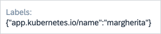

# Display widgets

Display widgets are used in the lists and details pages.

## Inline widgets

Inline widgets are used for simple values and are usable in lists, details headers, and details bodies.

### Text

Text widgets render values as a simple text. This is the default behavior for all scalar values.

#### Example

```json
{
  "path": "spec.label",
  "widget": "Text"
}
```

<p>

</p>

### Badge

Badge widgets render texts as a status badge, using a set of predefined rules to assign colors.

The following values are automatically handled:

- rendered as an information: `initial`, `pending`, `available`, `released`.
- rendered as a success: `ready`, `bound`, `running`, `success`, `succeeded`, `ok`.
- rendered as a warning: `unknown`, `warning`.
- rendered as an error: `error`, `failure`, `invalid`.

#### Example

```json
{
  "path": "status.value",
  "widget": "Badge"
}
```

<p>

</p>

## Block widgets

Block widgets are more complex layouts and should be used only in details body.

### Plain

Plain widgets render all contents of an object or list sequentially without any decorations. This is the default behavior for all objects and arrays.

### Panel

Panel widgets render an object as a separate panel with it's own title (based on it's `path` or `name`).

#### Example

```json
{
  "name": "details",
  "widget": "Panel",
  "children": [{ "path": "spec.value" }, { "path": "spec.other-value" }]
}
```

<p>

</p>

### Columns

Columns widgets render the child widgets in two columns.

#### Example

```json
{
  "name": "columns.container",
  "widget": "Columns",
  "children": [
    {
      "name": "columns.left",
      "widget": "Panel",
      "children": [{ "path": "spec.value" }]
    },
    {
      "name": "columns.right",
      "widget": "Panel",
      "children": [{ "path": "spec.other-value" }]
    }
  ]
}
```

<p>

</p>

### CodeViewer

CodeViewer widgets display values using the code highlight.

#### Widget-specific parameters

- **language** - language used for the code highlighting.

#### Example

```json
{
  "path": "spec.json-data",
  "widget": "CodeViewer",
  "language": "json"
}
```

<p>

</p>

### Table

Table widgets display array data as rows of a table instead of free-standing components. The `children` parameter defines the values used to render the columns. Similar to the `list` section of the Config Map, only inline widgets should be used as children.

#### Example

```json
{
  "path": "spec.item-list",
  "widget": "Table",
  "children": [{ "path": "name" }, { "path": "status" }]
}
```

<p>

</p>
