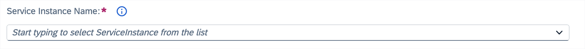
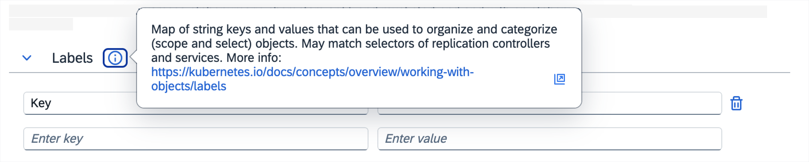
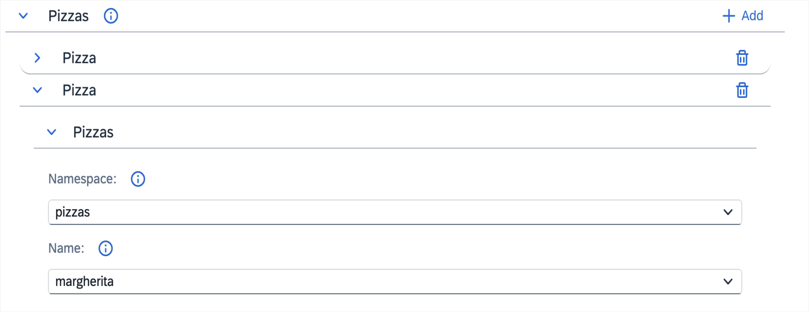

# Create forms with extensibility

- [_Form_ overview](#form-overview)
  - [Variable fields](#variable-fields)
- [Simple widgets](#simple-widgets)
  - [Text](#text)
  - [Name](#name)
  - [CodeEditor](#codeeditor)
  - [Resource](#resource)
- [Complex widgets](#complex-widgets)
  - [KeyValuePair](#keyvaluepair)
  - [ResourceRef](#resourceref)
- [Presentation widgets](#presentation-widgets)
  - [FormGroup](#formgroup)
  - [GenericList](#genericlist)
  - [SimpleList](#simplelist)

# Form overview

The **form** section contains a list of objects that define which fields are included in the final form. All given fields are placed in the advanced form by default. It's possible to add a field to the simple form by providing the `simple: true` flag. You can also remove it from the advanced form by providing the `advanced: false` flag.

Any parameters that are not handled by the widget are added to the schema directly, so it's possible to add or override existing values. For example, add an **enum** parameter to provide selectable values in a field.

If you target elements of an array rather than the array itself, you can use the `items[]` notation.

### Item parameters

- **path** - _[required]_ path to the property that you want to display in the form.
- **name** - an optional name for the field instead of the default capitalized last part of the path. This can be a key from the **translation** section.
- **widget** - optional widget used to render the field referred to by the **path** property. If you don't provide the widget, a default handler is used depending on the data type provided in the schema. For more information about the available widgets, see [Form section](form-section.md).
- **children** - child widgets used for grouping. Child paths are relative to its parent.
- **simple** - parameter used to display the simple form. It is `false` by default.
- **advanced** - parameter used to display the advanced form. It is `true` by default.
- **visibility** - a [JSONata](https://docs.jsonata.org/overview.html) expression controlling the visibility of the element.

### Example

```json
[
  { "path": "spec.priority", "simple": true },
  {
    "path": "spec.items[]",
    "children": [
      { "path": "name", "name": "Item name" },
      { "path": "service.url" },
      { "path": "service.port" }
    ]
  }
]
```

### Variable fields

Additionally, it's possible to define variable fields. In this case, **path** is omitted, and a **var** argument is used to specify the variable name to assign. Variable names have to be unique across the extension. Such a value is not added to the resultant YAML but instead stored in memory and provided to any [JSONata](https://docs.jsonata.org/overview.html) handlers as variables, for example, `$foo`. Variables are provided for the current context. If a variable is defined inside an array, the value is specified for that specific item. To access raw values, the predefined `$vars` variable has to be used.

When using a variable inside an array it has to be wrapped inside a `[]` element (see [example](#example)).

### Item parameters

- **var** - _[required]_ variable name.
- **type** - _[required]_ type of field, as defined by JSON Schema.

All other fields can be used analogously to regular form items (except for the **path** and **children** parameters).

### Predefined variables

All JSONata expressions have a few variables that are predefined instead of being read from variable fields.

- **\$item** - when in an array this contains the current item.
- **\$index** - contains the index of the current item within the array.
- **\$indexes** - contains a list of all the indexes for nested arrays.
- **\$vars** - contains a map of all the raw variable values.

### Example

In the example, the visibility for item price and color are analogous - the former uses scoped variables for the current item, and the latter extracts the value from an array variable using provided index - this is mostly useful for complex scenarios only.

```json
[
  { "var": "useDescription", "type": "boolean" },
  { "path": "spec.description": "visibility": "$useDescription" },
  { "path": "spec.items", "widget": "GenericList": "children": [
    { "path": "[]", "children": [
      { "path": "name" },
      { "var": "itemMode", "type": "string", "enum": ["simple", "verbose"] },
      { "path": "price", "visibility": "$itemMode = 'verbose'" },
      { "path": "color", "visibility": "$vars.itemMode[$index] = 'verbose'" },
      { "path": "description", "visibility": "$useDescription" }
    ]}
  ]}
]
```

# Form widgets

Form widgets are used in the resource forms.

## Simple widgets

Simple widgets represent a single scalar value.

### Text

Text widgets render a field as a text field. They are used by default for all string values.

#### Example

```json
{
  "path": "spec.my-data",
  "widget": "Text"
}
```


#### Widget-specific parameters

- **enum[]** - an array of options to generate an input field with a dropdown. Optionally can be a string containing a JSONata expression returning an array of options.
- **placeholder** - specifies a short hint about the input field value.
- **required** - a boolean which specifies if a field is required. The default value is taken from CustomResourceDefintion (CRD); if it doesn't exist in the CRD, then it defaults to `false`.

#### Example

```json
{
  "path": "protocol",
  "simple": true,
  "enum": [
    "HTTP",
    "HTTPS",
    "HTTP2",
    "GRPC",
    "GRPC-WEB",
    "MONGO",
    "REDIS",
    "MYSQL",
    "TCP"
  ],
},
```


### Name

Name widgets render a name input field. They contain an automatic name generator, and additionally set the label field when changed. They are added automatically to all forms, and set to the `metadata.name` value.

#### Widget-specific parameters

- **extraPaths** - an array of extra paths to fill in with the contents of the field. Each path can either be a period-separated string or an array of strings.
- **showHelp** - if set to `false` it disables the additional help message.
- **placeholder** - specifies a short hint about the input field value.

#### Example

```json
{
  "path": "spec.my-data",
  "widget": "Name"
}
```


### CodeEditor

CodeEditor widgets render a versatile code editor that can be used to edit any variable. The editor's default language is JSON.

#### Widget-specific parameters

- **language** - a jsonata expression resolving the desired language. It has access to `$root` variable, containing the entire resource.

#### Example

```json
{
  "path": "spec.my-data",
  "widget": "CodeEditor",
  "language": "'JSON'"
}
```

> NOTE: Remember to put both single and double quotes if you want to use plain language (e.g. "'YAML'"). Specyfing just double quotes ("YAML") makes Busola try to access nonexistent `YAML` variable, resulting the language to be `undefined`.

### Resource

Resource widgets render a dropdown list of specified resources and store the selected one as a string containing its name.

#### Widget-specific parameters

- **resource**:
  - **kind** - _[required]_ Kubernetes kind of the resource.
  - **group** - API group used for all requests. Not provided for Kubernetes resources in the core (also called legacy) group.
  - **version** - _[required]_ API version used for all requests.
  - **scope** - either `namespace` or `cluster`. When set to `cluster`, namespaced resources are fetched from all Namespaces. Defaults to `cluster`.
  - **namespace** - Namespace to fetch resources from. Used only when scope is `namespace` and resources need to be fetched from a specific Namespace. Defaults to the active Namespace when omitted.
- **required** - a boolean which specifies if a field is required. The default value is taken from CRD; if it doesn't exist in CRD, then it defaults to `false`.

#### Example

```json
[
  {
    "path": "spec.namespace",
    "widget": "Resource",
    "resource": {
      "scope": "cluster",
      "kind": "Namespace",
      "version": "v1"
    }
  },
  {
    "path": "spec.gateway",
    "widget": "Resource",
    "resource": {
      "kind": "Gateway",
      "scope": "namespace",
      "namespace": "kyma-system",
      "group": "networking.istio.io",
      "version": "v1alpha3"
    }
  }
]
```



## Complex widgets

Complex widgets handle more advanced data structures such as arrays or objects.

### KeyValuePair

KeyValuePair widgets render an `object` value as a list of fields. One is used for a key and the other for a value, allowing for adding and removing entries.

#### Widget-specific parameters

- **keyEnum[]** - an array of options to generate a key input field with a dropdown.
- **value**:
  - **type** - a string that specifies the type of the value input. The options are `object`, `number`, `text`. Defaults to `text`.
  - **keyEnum[]** - an array of options to generate a key input field with a dropdown only if the `type` is set to `object`.
  - **valueEnum[]** - an array of options to generate a value input field with a dropdown.

#### Example

```json
{
  "path": "spec.my-data",
  "widget": "KeyValuePair",
  "keyEnum": ["prefix", "regex", "exact"]
}
```



### ResourceRef

ResourceRef widgets render two dropdowns to select the associated resources' names and Namespaces. The corresponding specification object is of the form `{name: 'foo', namespace: 'bar'}`. If this widget is provided with children, they are rendered as usual.

#### Widget-specific parameters

- **resource**:
  - **kind** - _[required]_ Kubernetes kind of the resource.
  - **group** - API group used for all requests. Not provided for Kubernetes resources in the core (also called legacy) group.
  - **version** - _[required]_ API version used for all requests.
- **provideVar** - When this field is defined, the chosen resource will be provided as a variable of this name.
- **toInternal** - A JSONata function to convert from the stored value to the `{name, namespace}` format. Useful, for example, when the data is stored as a string.
- **toExternal** - A corresponding function to convert back to store.

#### Example

```json
[
  {
    "path": "spec.my-data",
    "widget": "ResourceRef",
    "resource": {
      "kind": "Secret",
      "version": "v1"
    },
    "provideVar": "secret",
    "children": [{ "path": "key", "enum": "$keys($secret.data)" }]
  },
  {
    "path": "spec.my-gateways",
    "widget": "ResourceRef",
    "resource": {
      "kind": "Gateway",
      "group": "networking.istio.io",
      "version": "v1alpha3"
    },
    "toInternal": "( $values := $split($, '/'); { 'namespace': $values[0], 'name': $values[1] } )",
    "toExternal": "namespace & '/' & name"
  }
]
```



## Presentation widgets

Presentation widgets do not handle data directly and only serve to group contents into a more readable form.

### FormGroup

FormGroup widgets render an `object` as a collapsible section.

#### Widget-specific parameters

- **columns** - number of columns the content should be rendered in. Defaults to 1.

#### Example

```json
[
  {
    "path": "spec.service",
    "widget": "FormGroup",
    "children": [
      {
        "path": "host"
      },
      {
        "path": "port"
      }
    ]
  }
]
```


### GenericList

GenericList widgets render an `array` as a list of collapsible sections with their own sub-forms. An **add** button is present to add new entries.

#### Example

```json
[
  {
    "path": "spec.services",
    "widget": "GenericList",
    "children": [
      {
        "path": "[].host"
      },
      {
        "path": "[].port"
      }
    ]
  }
]
```


#### Widget-specific parameters

- **placeholder** - specifies a short hint about the input field value.

### SimpleList

SimpleList widgets render an `array` as a table with rows representing data items and columns representing different fields. New items are added automatically when new entries are typed in.

This type of field is only suitable for simple data types and can contain more complex structures in its items.

#### Example

```json
[
  {
    "path": "spec.services",
    "widget": "SimpleList",
    "children": [
      {
        "path": "[].host"
      },
      {
        "path": "[].port"
      }
    ]
  }
]
```


#### Widget-specific parameters

- **placeholder** - specifies a short hint about the input field value.
- **required** - a boolean which specifies if a field is required. The default value is taken from CRD; if it doesn't exist in the CRD, then it defaults to `false`.

#### Scalar values

When array items are scalars instead of objects, no header with the field title will be rendered in the resulting table.
