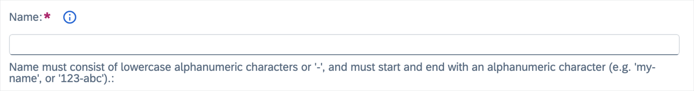

# Form widgets

- [Simple widgets](#simple-widgets)
  - [Text](#text)
  - [Name](#name)
  - [CodeEditor](#codeeditor)
  - [Resource](#resource)
- [Complex widgets](#complex-widgets)
  - [KeyValuePair](#keyvaluepair)
  - [ResourceRefs](#resourcerefs)
- [Presentation widgets](#presentation-widgets)
  - [FormGroup](#formgroup)
  - [GenericList](#genericlist)
  - [SimpleList](#simplelist)

Form widgets are used in the resource forms.

## Simple widgets

Simple widgets represent a single scalar value.

### Text

Text widgets render a field as a text field. They are used by default for all string values.

#### Example

```json
{
  "path": "spec.my-data",
  "widget": "Text"
}
```


#### Widget-specific parameters

- **enum[]** - an array of options to generate an input field with a dropdown.
- **placeholder** - specifies a short hint about the input field value.
- **required** - a boolean which specifies if a field is required. The default value is taken from CRD; if it doesn't exist in CRD, then it defaults to `false`.

#### Example

```json
{
  "path": "protocol",
  "simple": true,
  "enum": [
    "HTTP",
    "HTTPS",
    "HTTP2",
    "GRPC",
    "GRPC-WEB",
    "MONGO",
    "REDIS",
    "MYSQL",
    "TCP"
  ],
},
```


### Name

Name widgets render a name input field. They contain an automatic name generator, and additionally set the label field when changed. They are added automatically to all forms, and set to the `metadata.name` value.

#### Widget-specific parameters

- **extraPaths** - an array of extra paths to fill in with the contents of the field. Each path can either be a period-separated string or an array of strings.
- **showHelp** - if set to `false` it disables the additional help message.
- **placeholder** - specifies a short hint about the input field value.

#### Example

```json
{
  "path": "spec.my-data",
  "widget": "Name"
}
```



### CodeEditor

CodeEditor widgets render a versatile code editor that can be used to edit any variable. The editor's default language is JSON.

#### Example

```json
{
  "path": "spec.my-data",
  "widget": "CodeEditor"
}
```

### Resource

Resource widgets render a dropdown list of specified resources and store the selected one as a string containing its name.

#### Widget-specific parameters

- **resource**:
  - **kind** - _[required]_ Kubernetes kind of the resource.
  - **group** - API group used for all requests. Not provided for Kubernetes resources in the core (also called legacy) group.
  - **version** - _[required]_ API version used for all requests.
  - **scope** - either `namespace` or `cluster`. When set to `cluster`, namespaced resources are fetched from all Namespaces. Defaults to `cluster`.
  - **namespace** - Namespace to fetch resources from. Used only when scope is `namespace` and resources need to be fetched from a specific Namespace. Defaults to the active Namespace when omitted.
- **required** - a boolean which specifies if a field is required. The default value is taken from CRD; if it doesn't exist in CRD, then it defaults to `false`.

#### Example

```json
[
  {
    "path": "spec.namespace",
    "widget": "Resource",
    "resource": {
      "scope": "cluster",
      "kind": "Namespace",
      "version": "v1"
    }
  },
  {
    "path": "spec.gateway",
    "widget": "Resource",
    "resource": {
      "kind": "Gateway",
      "scope": "namespace",
      "namespace": "kyma-system",
      "group": "networking.istio.io",
      "version": "v1alpha3"
    }
  }
]
```


## Complex widgets

Complex widgets handle more advanced data structures such as arrays or objects.

### KeyValuePair

KeyValuePair widgets render an `object` value as a list of dual text fields. One is used for a key and the other for a value, allowing for adding and removing entries.

#### Example

```json
{
  "path": "spec.my-data",
  "widget": "KeyValuePair"
}
```


#### Widget-specific parameters

- **required** - a boolean which specifies if a field is required. The default value is taken from CRD; if it doesn't exist in CRD, then it defaults to `false`.

### ResourceRefs

ResourceRefs widgets render the lists of dropdowns to select the associated resources' names and Namespaces. The corresponding specification object must be an array of objects `{name: 'foo', namespace: 'bar'}`.

#### Widget-specific parameters

- **resource**:
  - **kind** - _[required]_ Kubernetes kind of the resource.
  - **group** - API group used for all requests. Not provided for Kubernetes resources in the core (also called legacy) group.
  - **version** - _[required]_ API version used for all requests.

#### Example

```json
[
  {
    "path": "spec.my-data[]",
    "widget": "ResourceRefs",
    "resource": {
      "kind": "Secret",
      "version": "v1"
    }
  },
  {
    "path": "spec.my-gateways[]",
    "widget": "ResourceRefs",
    "resource": {
      "kind": "Gateway",
      "group": "networking.istio.io",
      "version": "v1alpha3"
    }
  }
]
```


## Presentation widgets

Presentation widgets do not handle data directly and only serve to group contents into a more readable form.

### FormGroup

FormGroup widgets render an `object` as a collapsible section.

#### Example

```json
[
  {
    "path": "spec.service",
    "widget": "FormGroup",
    "children": [
      {
        "path": "host"
      },
      {
        "path": "port"
      }
    ]
  }
]
```


### GenericList

GenericList widgets render an `array` as a list of collapsible sections with their own sub-forms. An **add** button is present to add new entries.

#### Example

```json
[
  {
    "path": "spec.services",
    "widget": "GenericList",
    "children": [
      {
        "path": "[].host"
      },
      {
        "path": "[].port"
      }
    ]
  }
]
```


#### Widget-specific parameters

- **placeholder** - specifies a short hint about the input field value.

### SimpleList

SimpleList widgets render an `array` as a table with rows representing data items and columns representing different fields. New items are added automatically when new entries are typed in.

This type of field is only suitable for simple data types and can contain more complex structures in its items.

#### Example

```json
[
  {
    "path": "spec.services",
    "widget": "SimpleList",
    "children": [
      {
        "path": "[].host"
      },
      {
        "path": "[].port"
      }
    ]
  }
]
```


#### Widget-specific parameters

- **placeholder** - specifies a short hint about the input field value.
- **required** - a boolean which specifies if a field is required. The default value is taken from CRD; if it doesn't exist in the CRD, then it defaults to `false`.

#### Scalar values

When array items are scalars instead of objects, no header with the field title will be rendered in the resulting table.
