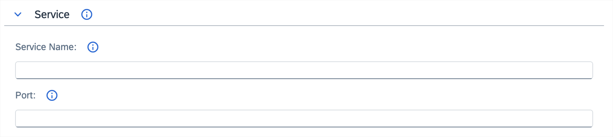

# Form widgets

Form widgets are used in the resource forms.

## Simple widgets

Simple widgets represent a single scalar value.

### Text

Text widgets render a field as a text field. They are used by default for all string values.

#### Example

```json
{
  "path": "spec.my-data",
  "widget": "Text"
}
```

<p>

</p>

### Name

Name widgets render a name input field. They contain an automatic name generator, and additionally set the label field when changed. They are added automatically to all forms, and set to the `metadata.name` value.

#### Widget-specific parameters

- **extraPaths** - an array of extra paths to fill in with the contents of the field. Each path can either be a period-separated string or an array of strings.

#### Example

```json
{
  "path": "spec.my-data",
  "widget": "Name"
}
```

<p>

</p>

## Complex widgets

Complex widgets handle more advanced data structures such as arrays or objects.

### KeyValuePair

KeyValuePair widgets render an `object` value as a list of dual text fields. One is used for a key and the other for a value, allowing for adding and removing entries.

#### Example

```json
{
  "path": "spec.my-data",
  "widget": "KeyValuePair"
}
```

<p>

</p>

## Presentation widgets

Presentation widgets do not handle data directly and only serve to group contents into a more readable form.

### FormGroup

FormGroup widgets render an `object` as a collapsible section.

#### Example

```json
({
  "name": "spec.service",
  "widget": "FormGroup"
},
{
  "path": "spec.service.host"
},
{
  "path": "spec.service.port"
})
```

<p>

</p>
