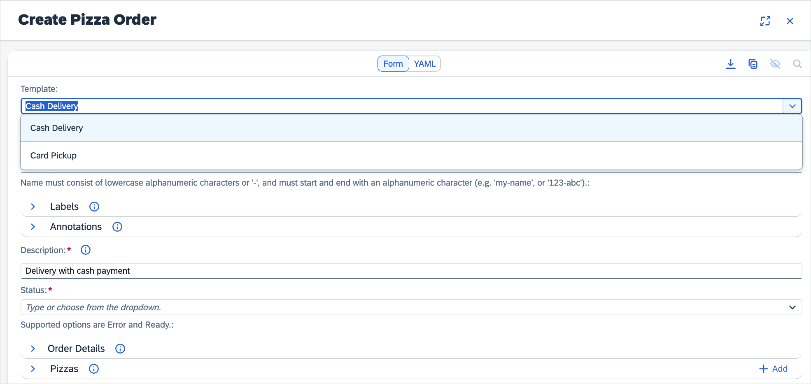

# _presets_ section

The **presets** section contains a list of objects that define which preset and template are used in the form view. If you specify a preset, it is displayed in the dropdown list along with the **Clear** option. When you select a preset, the form is filled with the values defined in the **value** property.

## preset configuration object fields

- **name** - _[required]_ a name to display on the preset's dropdown,
- **value** - _[required]_ contains fields that are set when you choose this preset from the list.
- **default** - For `default` equal to `true`, it prefills form with values defined in the **value** property. Defaults to `false`.

## Example

```json
[
  {
    "name": "template",
    "default": true,
    "value": {
      "metadata": {
        "name": "my-name"
      },
      "spec": {
        "description": "A set description"
      }
    }
  },
  {
    "name": "preset",
    "value": {
      "metadata": {
        "name": "second-one"
      },
      "spec": {
        "data": "regex",
        "description": "A different description",
        "items": [
          {
            "name": "item-1",
            "value": 10
          },
          {
            "name": "item-2",
            "value": 11
          },
          {
            "name": "item-3",
            "value": 5
          }
        ]
      }
    }
  }
]
```


