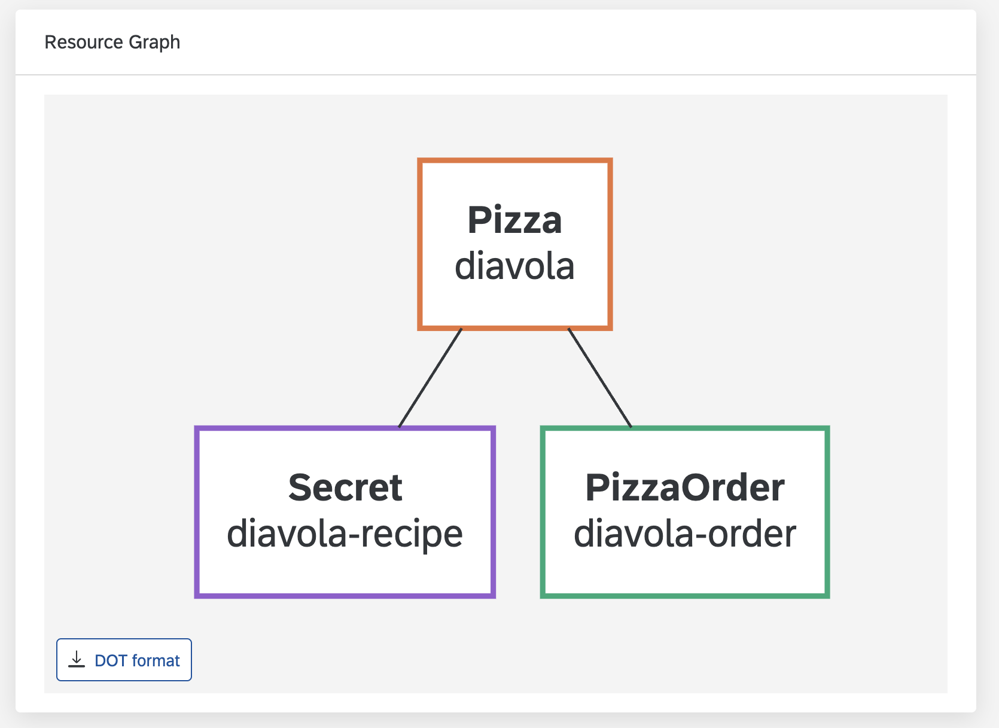

# Config Map for resource-based extensions

**Table of Contents**

- [Overview](#overview)
- [Extension version](#extension-version)
- [_general_ section](#general-section)
- [_form_ section](#form-section)
- [_list_ section](#list-section)
- [_details_ section](#details-section)
  - [Data scoping](#data-scoping)
- [_dataSources_ section](#datasources-section)
  - [Data source configuration object fields](#data-source-configuration-object-fields)
- [_translations_ section](#translations-section)
  - [Value preprocessors](#value-preprocessors)
    - [List of value preprocessors](#list-of-value-preprocessors)

## Overview

This document describes the required ConfigMap setup that you need to configure in order to handle your CRD UI page.
You can provide all the ConfigMap data sections as either JSON or YAML.

## Extension version

The version is a string value that defines in which version the extension is configured. It is stored as a value of the `busola.io/extension-version` label. If the configuration is created with the **Create Extension** button, this value is provided automatically. When created manually, use the latest version number, for example, `'0.5'`

Busola supports only the current version of the configuration and the prior one.

Therefore, whenever a new version of the configuration is proposed, you can migrate your configuration to the latest version. To do so, go to your Extension and click the **Migrate** button.

## _general_ section

The **general** section is required and contains basic information about the resource and additional options.

### Item parameters

- **resource** - _[required]_ - information about the resoure.
  - **kind** - _[required]_ Kubernetes kind of the resource.
  - **version** - _[required]_ API version used for all requests.
  - **group** - API group used for all requests. Not provided for Kubernetes resources in the core (also called legacy) group.
  - **name** - title used in the navigation and on the list screen. It defaults to its resource kind.
- **category** the name of a category used for the left-hand menu. It is placed in the `Custom Resources` category by default.
- **scope** - either `namespace` or `cluster`. Defaults to `cluster`.
- **urlPath** - path fragment for this resource used in the URL. Defaults to pluralized lowercase **kind**. Used to provide an alternative URL to avoid conflicts with other resources.
- **defaultPlaceholder** - to be shown in place of empty resource leaves. Overridden by the widget-level **placeholder**. Defaults to `-`.
- **description** - displays a custom description on the resource list page. It can contain links. If the **translations** section has a translation entry with the ID that is the same as the **description** string, the translation is used.
- **filter** - optional [JSONata](https://docs.jsonata.org/overview.html) [filter](https://docs.jsonata.org/higher-order-functions#filter) used to filter the resources shown at the list section property.
- **disableCreate** - either `true` or `false`. Defaults to `false`.

### Example

```json
{
  "resource": {
    "kind": "MyResource",
    "version": "v1alpha3",
    "group": "networking.istio.io"
  },
  "name": "MyResourceName",
  "category": "My Category",
  "scope": "namespace",
  "defaultPlaceholder": "- not set -",
  "description": "See the {{[docs](https://github.com/kyma-project/busola)}} for more information.",
  "filter": "$filter(data, function($item) {$item.type = 'Opaque'})",
  "disableCreate": false
}
```

## _form_ section

The **form** section contains a list of objects that define which fields you must include in the final form. All given fields are placed in the advanced form by default. It's possible to add a field to the simple form by providing the `simple: true` flag. You can also remove it from the advanced form by providing the `advanced: false` flag.

If you target elements of an array rather that the array itself, you can use `items[]` notation.

### Item parameters

- **path** - _[required]_ path to the property that you want to display in the form.
- **name** - an optional name for the field instead of the default capitalized last part of the path. This can be a key from the **translation** section.
- **widget** - optional widget used to render the field referred to by the **path** property. If you don't provide the widget, a default handler is used depending on the data type provided in the schema. For more information about the available widgets, see [Form widgets](form-widgets.md).
- **children** - child widgets used for grouping. Child paths are relative to its parent.
- **simple** - parameter used to display the simple form. It is `false` by default.
- **advanced** - parameter used to display the advanced form. It is `true` by default.

### Example

```json
[
  { "path": "spec.priority", "simple": true },
  {
    "path": "spec.items[]",
    "children": [
      { "path": "name", "name": "Item name" },
      { "path": "service.url" },
      { "path": "service.port" }
    ]
  }
]
```

## _list_ section

The **list** section defines extra columns available in the list.

### Item parameters

- **source** - _[required]_ contains a [JSONata](https://docs.jsonata.org/overview.html) expression used to fetch data for the column. In its simplest form it's just the path to the value.
- **widget** - optional widget used to render the field referred to by the **source** property. By default, the value is displayed verbatim. For more information about the available widgets, see [Display widgets](display-widgets.md).
- **valuePreprocessor** - name of [value preprocessor](#value-preprocessors).
- **sort** - optional sort option. If set to `true`, it allows you to sort using this value. Defaults to false. It can also be set to an object with the following properties:
  - **default** - optional flag. If set to `true`, the list view is sorted by this value by default.
  - **compareFunction** - optional [JSONata](https://docs.jsonata.org/overview.html) compare function. It is required to use `$first` and `$second` variables when comparing two values. There is a special custom function [compareStrings](jsonata.md#comparestringsfirst-second) used to compare two strings, for example, `$compareStrings($first, $second)`

### Example

```json
[
  {
    "source": "spec.url",
    "sort": {
      "default": true,
      "compareFunction": "$compareStrings($first, $second)"
    }
  },
  { "source": "spec.priority", "widget": "Badge" },
  { "source": "$join(spec.toppings.name, ', ')" },
  {
    "name": "quantityIsMore",
    "source": "$filter(spec.toppings, function ($v, $i, $a) { $v.quantity > $average($a.quantity) })"
  },
  { "source": "$join(spec.volumes.name, ', ')" },
  {
    "source": "$filter(spec.volumes, function ($v, $i, $a) {'configMap' in $keys($v)})" // List the array of Volume objects that have a config map
  },
  {
    "source": "spec.volumes['configMap' in $keys($)]" // This is the alternative way of listing the array of Volume objects that have a config map
  },
  {
    "source": "$join(spec.volumes['configMap' in $keys($)].name, ', ')" // List volume names of volumes that have a config map
  }
]
```

## _details_ section

The **details** section defines the display structure for the details page. It contains three sections, `header`, `body`, and optional `resourceGraph`. The first two sections are a list of items to display in the **header** section and the body of the page respectively. The format of the entries is similar to the **form** section, however it has extra options available. The `resourceGraph` section is used to configure the ResourceGraph which shows relationships between various resources.

### Items parameters

- **source** - contains a [JSONata](https://docs.jsonata.org/overview.html) expression used to fetch data for the widget. In its simplest form it's just the path to the value. Not required for presentational widgets.
- **name** - Name for the primary label of this field. Required for most widgets (except for some rare cases that don't display a label). This can be a key to use from the **translation** section.
- **widget** - optional widget to render the defined entry. By default the value is displayed verbatim. For more information about the available widgets, see [Display widgets](display-widgets.md).
- **valuePreprocessor** - name of [value preprocessor](#value-preprocessors),
- **visibility** - by default all fields are visible; however **visibility** property can be used to control a single item display.
  - If set to `false` explicitly, the field doesn't render.
  - If set to any string, this property is treated as JSONata format, determining (based on current value given as `data`) if the field should be visible.
  - If not set, the field always renders.
- **children** - a list of child widgets used for all `object` and `array` fields.

Extra parameters might be available for specific widgets.

### Header and body xample

```json
{
  "header": [
    { "source": "metadata.name" },
    { "source": "spec.priority", "widget": "Badge" },
    { "source": "$join(spec.volumes.name, ', ')" }
  ],
  "body": [
    {
      "name": "columns",
      "widget": "Columns",
      "children": [
        { "name": "left-panel", "widget": "Panel" },
        { "name": "right-panel", "widget": "Panel" }
      ]
    },
    {
      "name": "summary",
      "widget": "Panel",
      "children": [
        { "source": "metadata.name" },
        { "source": "spec.priority", "widget": "Badge" },
        {
          "name": "Volumes names of volumes with config map",
          "source": "$join(spec.volumes['configMap' in $keys($)].name, ', ')"
        }
      ]
    },
    {
      "source": "spec.details",
      "widget": "CodeViewer",
      "language": "json"
    },
    {
      "source": "spec.configPatches",
      "widget": "Panel",
      "children": [
        { "source": "applyTo" },
        {
          "source": "match.context",
          "visibility": "$exists(data.match.context)"
        }
      ]
    },
    {
      "source": "spec.configPatches",
      "widget": "Table",
      "children": [{ "source": "applyTo" }, { "source": "match.context" }]
    }
  ]
}
```

### resourceGraph parameters

- **depth** - defines the maximum distance from the original resource to a transitively related resource. Defaults to infinity.
- **colorVariant** - optional integer in range 1 to 11 or 'neutral', denoting the SAP color variant of the node's border. If not set, the node's border is the same as the current text color.
- **networkFlowKind** - optional boolean which determines if the resource should be shown on the network graph, Defaults to `false`, which displays the resource on the structural graph.
- **networkFlowLevel** - optional integer which sets the horizontal position of the resource's node on the network graph.
- **dataSources** - an array of objects in shape:
  - **source** - a string that must correspond to one of the [dataSources](#datasources-section) name. It selects the related resource and the way it should be matched.

### resourceGraph example

```json
{
  "details": {
    "resourceGraph": {
      "colorVariant": 2,
      "dataSources": [
        {
          "source": "relatedSecrets"
        },
        {
          "source": "relatedPizzaOrders"
        }
      ]
    }
  },
  "dataSources": {
    "relatedSecrets": {
      "resource": {
        "kind": "Secret",
        "version": "v1"
      },
      "filter": "$root.spec.recipeSecret = $item.metadata.name"
    },
    "relatedPizzaOrders": {
      "resource": {
        "kind": "PizzaOrder",
        "group": "busola.example.com",
        "version": "v1"
      },
      "filter": "$item.spec.pizzas[name = $root.metadata.name and namespace = $root.metadata.namespace]"
    }
  }
}
```



### Data scoping

Whenever an entry has both **source** and **children** properties, the **children** elements are provided with extra variables.

In the case of objects, a `$parent` variable contains the data of the parent element.

For example:

```json
[
  {
    "source": "spec",
    "widget": "Panel",
    "children": [{ "source": "$parent.entry1" }, { "source": "$parent.entry2" }]
  }
]
```

will render the data for `spec.entry1` and `spec.entry2`.

In the case of array-based components, an `$item` variable contains data for each child. For example:

```json
[
  {
    "source": "spec.data",
    "widget": "Table",
    "children": [{ "source": "$item.name" }, { "source": "$item.description" }]
  }
]
```

renders `spec.data[].name` and `spec.data[].description`.

## _dataSources_ section

The **dataSources** section contains an object that maps a data source name to a data source configuration object. The data source name preceded by a dollar sign '\$' is used in the **source** expression.

Data sources are provided in all [JSONata](https://docs.jsonata.org/overview.html) formulas as functions to call. For example, `{ "source": $myRelatedResource().metadata.labels }` returns the `metadata.labels` of the related resource.

Since the whole request is being provided, individual resources can be accessed using the `items` field, for example `{ "widget": "Table", "source": "$myRelatedResources().items" }`.

### Data source configuration object fields

Those fields are used to build the related resource URL and filter the received data.

- **resource**:
  - **kind** - _[required]_ Kubernetes resource kind.
  - **group** - Kubernetes resource group. Not provided for Kubernetes resources in the core (also called legacy) group.
  - **version** - _[required]_ Kubernetes resource version.
  - **namespace** - the resource's Namespace name; it defaults to the original resource's Namespace. If set to `null`, cluster-wide resources or resources in all Namespaces are matched.
  - **name** - a specific resource name; leave empty to match all resources of a given type.
- **ownerLabelSelectorPath** - the path to original object's **selector** type property; for example, `spec.selector.matchLabels` for Deployment, used to select matching Pods.
- **filter** - [JSONata](https://docs.jsonata.org/overview.html) function enabling the user to write a custom matching logic. It uses the following variables:

  - **item** - the current item of the related kind.
  - **root** - the original resource.

  This function should return a boolean value.
  You can also use the `matchByLabelSelector` function to see the matched Pods. To do that, provide the Pods as `$item`, and path to the labels.

### Examples

```json
{
  "deployments": {
    "general": ...
    "details": {
       "body": [
         {
            "widget": "ResourceList",
            "source": "$myPods()"
        }
      ]
    }
  },
  "dataSources": {
    "myPods": {
      "resource": {
        "kind": "Pod",
        "version": "v1",
      },
      "ownerLabelSelectorPath": "spec.selector.matchLabels"
    }
  }
}
```

```json
{
  "secrets": {
    "general": ...
    "details": {
       "body": [
         {
            "widget": "ResourceList",
            "path": "$mySecrets"
        }
      ]
    }
  },
  "dataSources": {
    "mySecrets": {
      "resource": {
        "kind": "Secret",
        "version": "v1",
        "namespace": null
      },
      "filter": "$root.spec.secretName = $item.metadata.name and $root.metadata.namespace = $item.metadata.namespace"
    }
  }
}
```

```json
{
  "podSelector": {
    "resource": {
      "kind": "Pod",
      "version": "v1"
    },
    "filter": "$matchByLabelSelector($item, $root.spec.selector)"
  }
}
```

## _translations_ section

This optional section contains all available languages formatted for [i18next](https://www.i18next.com/) either as YAML or JSON, based on their paths. When a name is provided for a widget, that value can be used as the key, and the value is the translation for a specific language.

In addition, if no name is provided, form widgets automatically try to fetch a translation based on their **path** attribute, and if that fails, they use a prettified version of the last path item as their name (for example `spec.itemDescription` is prettified to "Item Description"), and by extension as a potential translation key.

### Example

```yaml
en:
  category: My category
  name: My Resource
  metadata:
    name: Name
  spec:
    items: Items
de:
  category: meine Kategorie
  name: Meine Ressource
  metadata:
    name: Name
  spec:
    items: Artikel
```

### Value preprocessors

Value preprocessors are used as a middleware between a value and the actual renderer. They can transform a given value and pass it to the widget; or stop processing and render it so you can view it immediately, without passing it to the widget.

#### List of value preprocessors

- **PendingWrapper** - useful when value resolves to a triple of `{loading, error, data}`:

  - For `loading` equal to `true`, it displays a loading indicator.
  - For truthy `error`, it displays an error message.
  - Otherwise, it passes `data` to the display component.

  Unless you need custom handling of error or loading state, we recommend using **PendingWrapper**, for example, for fields that use [data sources](#datasources-section).
