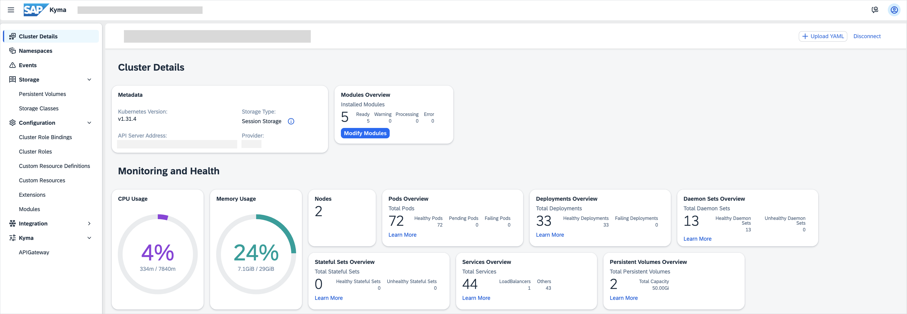

# Kyma Dashboard

Use Kyma dashboard to access various features and functionalities of Kyma runtime.

Kyma dashboard is a web-based UI utilizing the React library and the SAP Fiori Horizon design system. It works on top of the Busola UI and provides extensions to it. Kyma uses Kyma dashboard as a central administration dashboard, which provides a graphical overview of your cluster and all its resources.

You can also use Kyma dashboard as a standalone dashboard for managing Kubernetes clusters.

## Features

You can use Kyma dashboard to perform the following actions:

- Add, manage, and delete Kyma modules.
- Manage your namespaces.
- Manage your Kubernetes and Kyma resources.
- Generate access tokens based on service accounts and Kubernetes RoleBindings and ClusterRoleBindings, which regulate access using role-based access control (RBAC).
- Have a quick look at the basic cluster condition.

  

## Architecture

1. User opens Busola in a web browser.
2. Busola returns all elements required to run the Busola web application (scripts, HTML, styles, and images) in a user web browser.
3. Busola uses extensions to run Kyma components.
4. User performs operations using the Busola web application on a remote Kubernetes cluster by providing cluster connection details. These are typical Kubernetes CRUD operations or questions for Kyma Companion.
   5a. Busola backend proxies operations to a remote Kubernetes cluster.
   5b. Busola backend proxies questions to Kyma Companion.
5. The backend sends back a response to the Busola web application, which displays the returned information.
