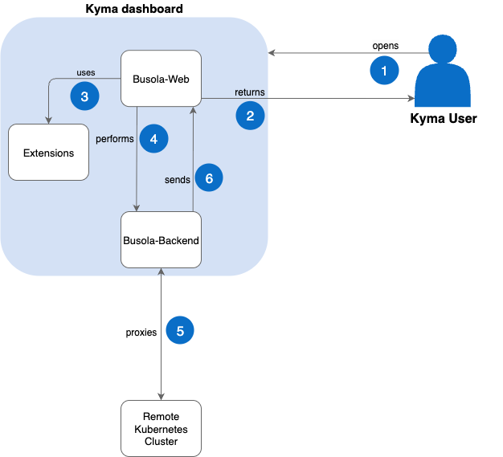

## Architecture

1. The user opens Kyma dashboard in a web browser.
2. Busola returns all elements required to run the Kyma dashboard web application (scripts, HTML, styles, and images) in a user web browser.
3. Busola uses Kyma dashboard extensions to run Kyma components.
4. User performs operations using Kyma dashboard on a remote Kubernetes cluster by providing cluster connection details. These are typical Kubernetes CRUD operations or questions for Kyma Companion.
5. Busola backend proxies operations to a remote Kubernetes cluster.

   5a. Busola backend proxies questions to Kyma Companion.

6. The backend sends back a response to Kyma dashboard, which displays the returned information.
