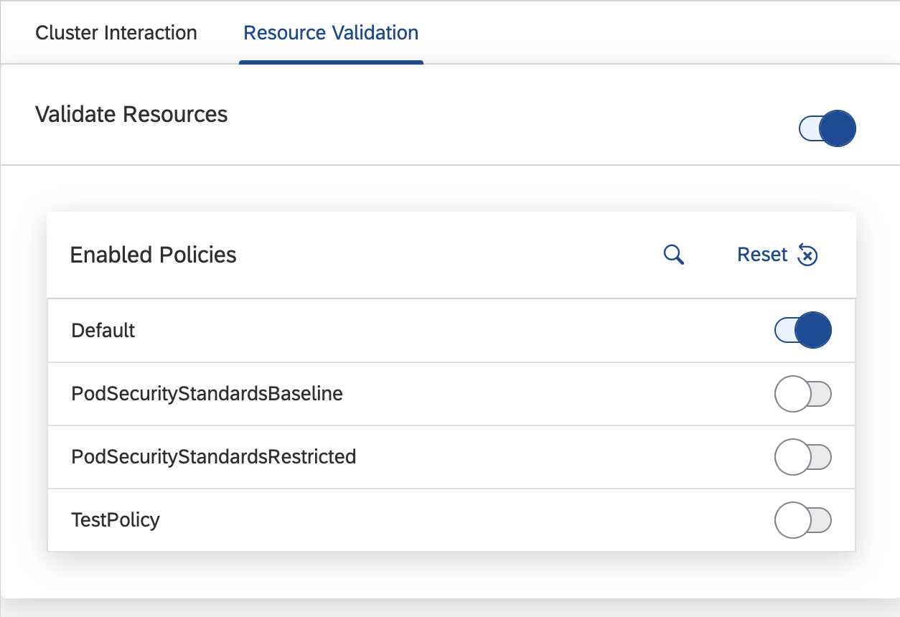

# Resource validation

## Overview

With Busola's resource validation feature, you can validate resources, for example, security and compliance, before uploading them to your cluster. The resource is active in the 'Upload YAML' dialog.

## Select policies

To choose which policies should be validated, you can either set a [feature flag](../features.md) or choose them via the user preferences.

In the user preferences, go to **Clusters > Resource Validation**. Click on **Customize** in the **Enabled Policies** section.



In the [feature flag](../features.md) config, set the following specifications:

```yaml
RESOURCE_VALIDATION:
  isEnabled: true
  config:
    policies:
      - Default
      - PodSecurityStandardsBaseline
```

## Upload Custom Rule Sets

To further customize the validation, you can upload your own rules and policies as a ConfigMap with the label `busola.io/resource-validation=rule-set`.

Rule sets consist of a rules array and a policies array. Both are optional.

A rule needs a `uniqueName`, `messageOnFailure` and `schema` property. The `schema` property follows the [json-schema specification](http://json-schema.org/draft-07/schema).

```yaml
rules:
  - uniqueName: TEST
    messageOnFailure: This is a test rule
    schema:
      required: [test]
      properties:
        test:
          type: string
          enum: [hello]
```

A policy needs a `name` and a `rules` property. The `rules` property must be an array containing references to rules via the rule's `uniqueName`.

```yaml
policies:
  - name: TestPolicy
    rules:
      - TEST
```

Policies can also reference rules in different rule sets as long as they are loaded in Busola.

For a full example, check the [example rule-set](../../examples/resource-validation/rule-set.yaml).
