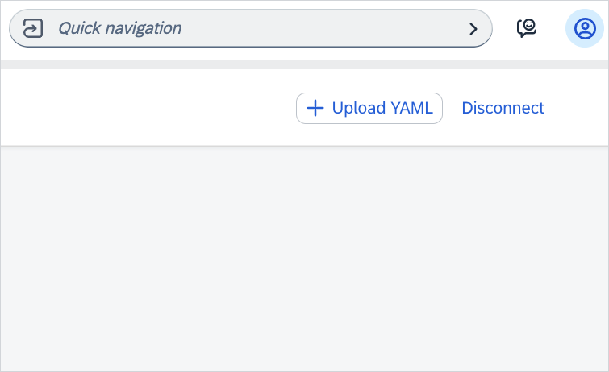
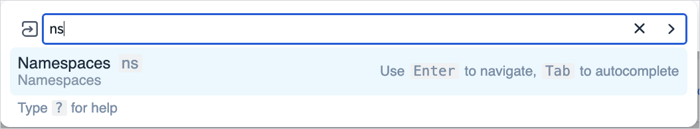
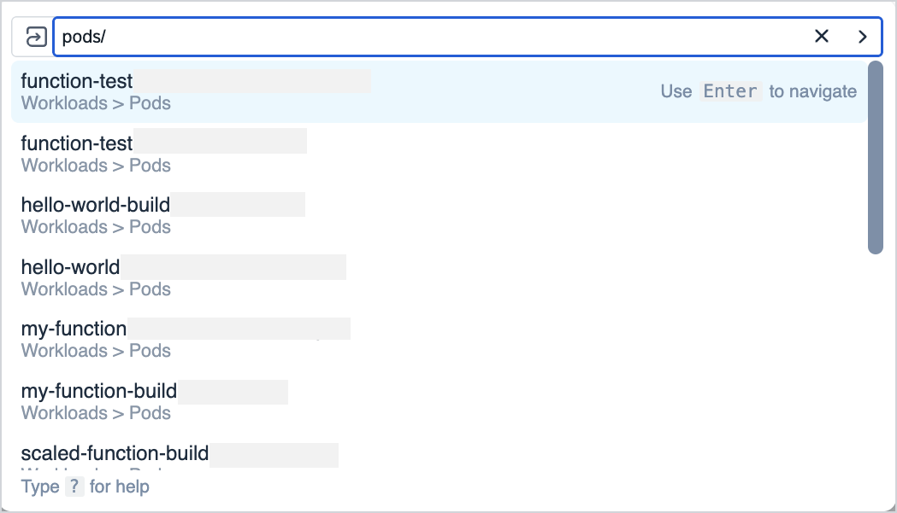
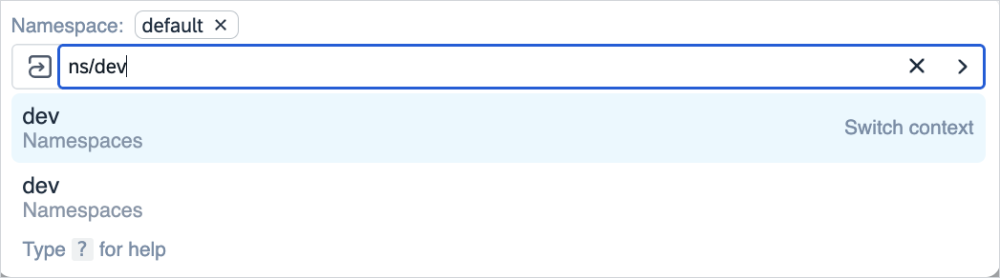

# Command Palette

With the Kyma dashboard command palette feature, you can easily navigate through all your dashboard resources, such as workloads, deployments, and more.
You can perform actions such as listing or accessing your namespaces, or preferences, or uploading YAML files.

## Features

You can use command palette to perform the following actions:

- Access command palette by pressing `cmd+k` on your keyboard or choosing **Quick Navigation**.

  

- Enter `?` to see all navigation options and the resources' aliases. For example, if you want to see your namespaces, it's enough to type `ns`.

  

- See the history of your actions by using the up or down arrow. Pressing the right arrow autocompletes your search.

- See the list of all resources available in the given namespace by entering the resource name and pressing the tab key.

  

- Switch contexts between your resources. For example, if you're viewing your available Pods on the `default` namespace, and you want to check the Pods on a different one, type `ns/{NAME_OF_YOUR_NAMESPACE}` and choose the `Switch Context` option. It takes you to the list of Pods in the selected namespace.

  
