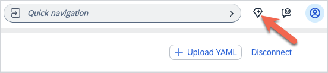

# Kyma Companion

Kyma Companion is an AI designed to assist with queries related to Kyma and Kubernetes. Its interface allows you to ask questions, and it analyzes the queries to provide direct responses or create subtasks for further assistance. The interaction flow involves understanding your request, checking for previous conversation context, and routing the query to the appropriate agents if necessary. Its goal is to ensure that you receive accurate and relevant information efficiently.

To access Kyma Companion, go to your Kyma dashboard, and click on the diamond icon in the top navigation bar.

## Error Handling and Recovery

Kyma Companion has the following error-handling procedures:

- Input validation - Validates user inputs to ensure they are clear and relevant. If the input is ambiguous or unclear, it asks for clarification.
- Graceful degradation - If the AI assistant encounters a situation where it cannot provide a specific answer, it offers related information or suggests alternative queries to help guide the user.
- Fallback responses - In cases where it cannot retrieve specific information, it provides a general response or directs the user to relevant resources or documentation.
- Error logging - Errors and unexpected behaviors are logged for analysis. This helps improve the system over time by identifying common issues and areas for enhancement.
- User feedback - Kyma Companion encourages users to provide feedback on its responses. If a user indicates that an answer was not helpful, it can adjust its approach in future interactions.

Kyma Companion uses the following recovery options:

- Clarification requests - If it does not understand a query, it can ask the user to rephrase or provide more context, allowing for a more accurate response.
- Providing alternatives - When it cannot answer a specific question, it can suggest related topics or questions that might be of interest to the user.
- Continuous learning - It learns from interactions to improve its responses over time. This includes adapting to user preferences and common queries.
- Escalation - If a query is beyond its capabilities, it can suggest that the user consult additional resources or experts in the relevant field. These procedures and options are designed to ensure that users have a positive experience and can find the information they need, even in the face of errors or misunderstandings.

## Rate Limiting

Rate limiting is a technique used in API management to control the number of requests a user can make to an API within a specified time frame. It is essential for ensuring fair usage of resources, protecting the API from abuse, and maintaining overall performance and reliability.

Rate limiting in Kyma Companion works in the following way:

- Kyma Companion usage is limited by [token](https://learn.microsoft.com/en-us/dotnet/ai/conceptual/understanding-tokens) usage per shoot/cluster for 24 hours.
- If the token consumption for a certain shoot exceeds the limit, then no further requests are served for that shoot/cluster.
- The token usage resets every 24 hours.

> [!WARNING]
> The limit is per shoot, not per user.
